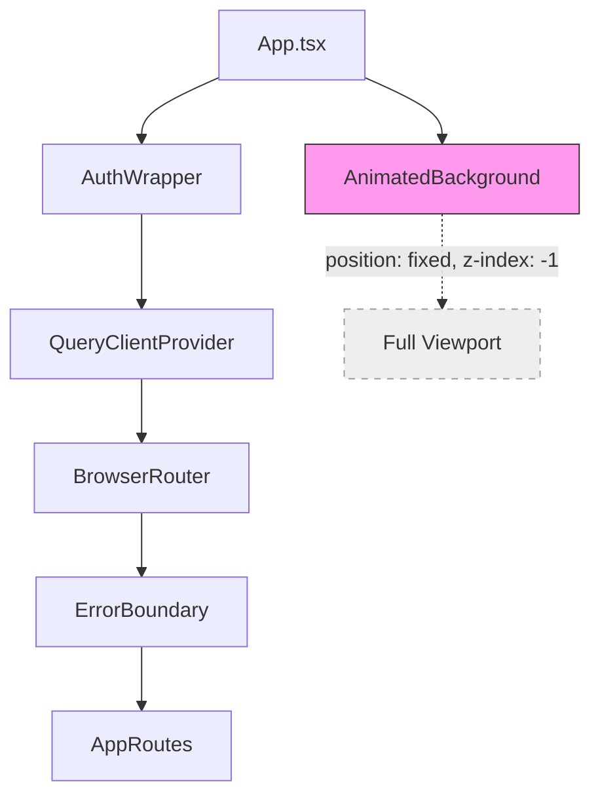

# Design Document: Animated Background

## Overview

This feature ports the animated floating blob background from the demo application (`/home/vincenzom/github/flowlee/demo`) into the production frontend. The implementation creates a single `AnimatedBackground` React component that renders 8 absolutely-positioned gradient blobs with CSS drift animations. The component mounts once at the app root level (outside the router) and persists across route transitions.

The existing per-step gradient backgrounds in `App.css` (`.container-sfondo` radial gradients, `.schermata-con-sfondo` pseudo-elements) and the inline gradient overlay in `CompanySettingsStep.tsx` will be removed, making the new component the single source of background visuals.

### Key Design Decisions

1. **CSS file for keyframes** rather than CSS-in-JS — matches the existing project pattern (App.css, TailwindCSS) and avoids runtime style injection overhead.
2. **Inline styles for blob positioning** — mirrors the demo's approach exactly, making the port straightforward and keeping the blob configuration self-contained within the component.
3. **`visible` prop with CSS visibility** — hides output without unmounting, avoiding animation restarts.
4. **Placed before `<BrowserRouter>`** — ensures no re-mount on route changes.

## Architecture



The `AnimatedBackground` component sits at the same level as `BrowserRouter` inside the `ErrorBoundary`, rendered before the router. It uses `position: fixed` with `inset: 0` and `z-index: -1` to stay behind all content regardless of route.

### File Structure

```
src/
├── components/
│   └── AnimatedBackground/
│       ├── AnimatedBackground.tsx    # Component with 8 blob divs
│       └── AnimatedBackground.css    # @keyframes blob-drift-1 through blob-drift-6
├── App.tsx                           # Imports and renders <AnimatedBackground />
└── App.css                           # Old gradient rules removed
```

## Components and Interfaces

### AnimatedBackground Component

```typescript
// src/components/AnimatedBackground/AnimatedBackground.tsx

interface AnimatedBackgroundProps {
  /** Controls visibility without unmounting. Defaults to true. */
  visible?: boolean;
}

export function AnimatedBackground({ visible = true }: AnimatedBackgroundProps): JSX.Element;
```

**Rendered DOM structure:**

```html
<div
  aria-hidden="true"
  style="
    position: fixed;
    inset: 0;
    width: 100vw;
    height: 100vh;
    z-index: -1;
    pointer-events: none;
    overflow: hidden;
    visibility: ${visible ? 'visible' : 'hidden'};
  "
>
  <!-- 8 blob divs with inline styles for position, size, gradient, blur, animation -->
  <div class="blob blob-1" style="..." />
  <div class="blob blob-2" style="..." />
  <!-- ... through blob-8 -->
</div>
```

**Blob configuration (ported from demo's PublicLayout.tsx):**

| Blob | Position | Size | Gradient Colors | Blur | Animation | Delay |
|------|----------|------|-----------------|------|-----------|-------|
| 1 | top: -20%, left: 50% | 80% × 60% | rgba(200,65,85,0.50) → rgba(170,45,95,0.25) | 55px | blob-drift-1, 10s | 0s |
| 2 | top: 0, left: -15% | 50% × 70% | rgba(110,55,175,0.40) | 65px | blob-drift-2, 8s | -3s |
| 3 | bottom: 5%, right: 3% | 11.25rem × 11.25rem | rgba(210,50,50,0.55) | 28px | blob-drift-3, 7s | -6s |
| 4 | bottom: -8%, left: 15% | 70% × 50% | rgba(80,160,230,0.50) → rgba(120,70,210,0.30) | 60px | blob-drift-4, 9s | -5s |
| 5 | top: 25%, right: 10% | 7rem × 9rem | rgba(255,230,100,0.35) | 35px | blob-drift-5, 8s | -2s |
| 6 | bottom: 20%, left: 5% | 8rem × 6rem | rgba(240,200,80,0.30) | 30px | blob-drift-4, 9s | -7s |
| 7 | top: 40%, left: 20% | 9rem × 7rem | rgba(130,200,255,0.35) | 32px | blob-drift-6, 7s | -4s |
| 8 | top: 10%, right: 25% | 6rem × 8rem | rgba(100,180,240,0.30) | 38px | blob-drift-5, 10s | -8s |

Each blob also gets `will-change: transform` for GPU compositing hints.

### Integration in App.tsx

```typescript
// Updated App.tsx render tree
function App() {
  return (
    <Suspense fallback={...}>
      <AuthWrapper>
        <QueryClientProvider client={queryClient}>
          <BrowserRouter>
            <ErrorBoundary>
              <AnimatedBackground />
              {/* ...existing children */}
              <AppRoutes />
            </ErrorBoundary>
          </BrowserRouter>
        </QueryClientProvider>
      </AuthWrapper>
    </Suspense>
  );
}
```

## Data Models

No data models required. This feature is purely presentational with no state persistence or API interaction.

## Error Handling

| Scenario | Handling |
|----------|----------|
| CSS file fails to load | Blobs render but without animation — static gradient circles remain visible as a graceful degradation |
| Browser doesn't support `filter: blur()` | Blobs display without soft edges — acceptable fallback |
| `will-change` not supported | No visual impact; property is a hint only |
| `visible` prop is invalid type | TypeScript catches at compile time; defaults to `true` at runtime |

The component has no error states that require user-facing feedback. It's a decorative layer that degrades gracefully.

## Testing Strategy

### Why Property-Based Testing Does NOT Apply

This feature is purely UI rendering and CSS animation:
- There is no business logic, data transformation, or computation to test with varying inputs
- The "correctness" of blob positioning is visual, not computational
- CSS animations cannot be meaningfully validated through property-based testing
- There are no pure functions with input/output behavior to verify

### Recommended Testing Approach

**Unit Tests (Vitest + React Testing Library):**

1. **Renders with aria-hidden** — verify the container has `aria-hidden="true"`
2. **Renders 8 blob children** — verify exactly 8 child divs exist inside the container
3. **Pointer events disabled** — verify `pointer-events: none` on container
4. **No focusable elements** — verify no elements with tabindex, links, or buttons inside the component
5. **Visible prop controls visibility** — verify `visibility: hidden` when `visible={false}` and DOM node remains mounted
6. **Visible prop defaults to true** — verify default rendering shows the blobs
7. **Fixed positioning** — verify container has `position: fixed` and `inset: 0`
8. **Overflow hidden** — verify container has `overflow: hidden`

**Visual Regression Tests (optional, manual):**

- Screenshot comparison against demo reference on viewport resize
- Verify no scrollbars appear at any standard viewport size

**Integration Verification (manual):**

- Confirm old `.container-sfondo` gradient backgrounds are removed from App.css
- Confirm CompanySettingsStep no longer renders its inline gradient overlay div
- Confirm onboarding cards still have white/semi-transparent background maintaining contrast
- Navigate between routes and verify no flash/remount of background

**Accessibility Checks:**

- Confirm the component is absent from the accessibility tree (axe-core audit)
- Verify keyboard tab sequence skips the background entirely

**Performance Verification (manual, DevTools):**

- Run a 5-second performance trace with 4× CPU throttling
- Confirm blob animations produce no Layout or Paint entries outside the background layer
- Confirm frame rate stays above 30fps

### CSS Architecture for Keyframes

The keyframe definitions live in `AnimatedBackground.css`, imported by the component:

```css
/* Reduced motion: stop all blob animations */
@media (prefers-reduced-motion: reduce) {
  .blob {
    animation-duration: 0.01ms !important;
    animation-iteration-count: 1 !important;
  }
}

@keyframes blob-drift-1 { /* ... ported from demo */ }
@keyframes blob-drift-2 { /* ... */ }
@keyframes blob-drift-3 { /* ... */ }
@keyframes blob-drift-4 { /* ... */ }
@keyframes blob-drift-5 { /* ... */ }
@keyframes blob-drift-6 { /* ... */ }
```

### Removal Checklist (Requirement 6)

1. **CompanySettingsStep.tsx** — Remove the absolute-positioned `<div>` with inline `radial-gradient` and `filter: blur(120px)` (the decorative overlay at z-index 0)
2. **App.css** — Remove these rule blocks:
   - `.container-sfondo` `background-image: radial-gradient(...)` declaration
   - `.container-sfondo.schermata-con-sfondo` background override (`background: #000 !important; background-image: none !important;`)
   - `.container-sfondo.schermata-con-sfondo::before` pseudo-element gradient
   - `.container-sfondo.schermata-con-sfondo::after` pseudo-element gradient
