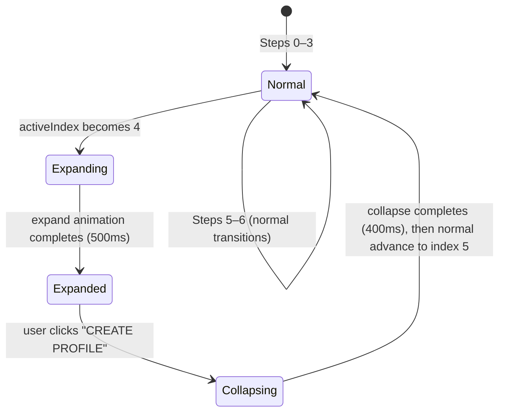

# Design Document: Card Expand Transition

## Overview

This feature adds a special "expand" animation to the WelcomeStep (index 4) in the `RegistrationCarousel`. Instead of the standard horizontal slide + mask-fade transition, the WelcomeStep card grows from its normal card dimensions to cover the full viewport, creating an impactful moment between account verification and profile creation. When the user clicks "CREATE PROFILE", the card collapses back to normal size, advances to RoleStep via the normal transition, and the TopNavigation bar animates into view.

The implementation introduces a new animation state machine layered on top of the existing carousel logic, using CSS transforms (scale) combined with fixed positioning to break out of the carousel's overflow constraints.

## Architecture

The expand/collapse behavior is an overlay concern on top of the existing `RegistrationCarousel`. Rather than modifying the core transition logic, we intercept the `advance` callback at the WelcomeStep boundary and drive a separate animation sequence.



### Key Design Decisions

1. **Fixed positioning for expand** — The WelcomeStep card switches to `position: fixed` during expansion so it can break out of the `.carousel-viewport` overflow: hidden constraint. This avoids needing to change parent overflow properties which would affect adjacent cards.

2. **CSS transform scale** — The expand uses `transform: scale(scaleX, scaleY)` to animate from card dimensions to viewport dimensions. Scale transforms are GPU-accelerated and avoid layout thrashing compared to width/height animations. The scale factors are computed as `viewportWidth / cardWidth` and `viewportHeight / cardHeight`.

3. **Separate collapse then advance** — Collapsing happens first (400ms), then the normal slide transition fires (500ms). This keeps the two animation systems independent and avoids complex coordination. The total time from click to RoleStep visible is ~900ms.

4. **TopNavigation rendered conditionally** — TopNavigation is only mounted in the DOM when `activeIndex >= 5`. Its entrance animation uses CSS transitions on opacity and transform, triggered by a state flag set after the normal advance to step 5 completes.

## Components and Interfaces

### Modified Components

#### `RegistrationCarousel`

New state additions:

```typescript
type ExpandState = 'idle' | 'expanding' | 'expanded' | 'collapsing'

// Inside RegistrationCarousel:
const [expandState, setExpandState] = useState<ExpandState>('idle')
const [showTopNav, setShowTopNav] = useState(false)
```

Modified `advance` callback logic:

```typescript
const advance = useCallback(() => {
  if (transitioning.current) return
  if (expandState === 'expanding' || expandState === 'collapsing') return

  // Arriving at WelcomeStep: trigger expand instead of normal advance
  if (activeIndex === 3) {
    transitioning.current = true
    setActiveIndex(4)
    setExpandState('expanding')

    // Animate outgoing card (index 3) mask as normal
    animateMask(3, 'left', 0, 1, CAROUSEL_CONFIG.transitionDuration)

    setTimeout(() => {
      setExpandState('expanded')
      transitioning.current = false
    }, CAROUSEL_CONFIG.transitionDuration)
    return
  }

  // Leaving WelcomeStep: collapse first, then normal advance
  if (activeIndex === 4 && expandState === 'expanded') {
    setExpandState('collapsing')
    transitioning.current = true

    setTimeout(() => {
      setExpandState('idle')
      // Now perform normal advance to index 5
      performNormalAdvance(4, 5)
      // After normal transition completes, show TopNavigation
      setTimeout(() => {
        setShowTopNav(true)
        transitioning.current = false
      }, CAROUSEL_CONFIG.transitionDuration)
    }, 400) // collapse duration
    return
  }

  // Normal advance for all other steps
  performNormalAdvance(activeIndex, activeIndex + 1)
}, [activeIndex, expandState, ...])
```

#### `WelcomeStep`

New prop to disable the button during animation:

```typescript
interface WelcomeStepProps {
  onNext: () => void
  disabled?: boolean // true during expand animation
}
```

The button receives `disabled={disabled}` and applies `disabled:opacity-40 disabled:cursor-not-allowed` classes.

#### `TopNavigation` (usage in RegistrationCarousel)

TopNavigation is rendered inside the carousel viewport, positioned absolutely above the card track:

```tsx
{showTopNav && (
  <div className={`top-nav-wrapper ${topNavVisible ? 'visible' : ''}`}>
    <TopNavigation onBack={handleBack} />
  </div>
)}
```

The `topNavVisible` flag is set slightly after mounting to trigger the CSS entrance animation.

### New CSS Classes

Added to `RegistrationCarousel.css`:

```css
/* --- Expand/Collapse animation for WelcomeStep --- */

.carousel-card.expanding {
  position: fixed;
  top: 50%;
  left: 50%;
  transform: translate(-50%, -50%);
  z-index: 100;
  width: 448px;
  height: 700px;
  animation: card-expand 500ms cubic-bezier(0.4, 0, 0.2, 1) forwards;
  overflow: hidden;
}

.carousel-card.expanded {
  position: fixed;
  top: 0;
  left: 0;
  width: 100vw;
  height: 100vh;
  z-index: 100;
  border-radius: 0;
  overflow: hidden;
}

.carousel-card.collapsing {
  position: fixed;
  top: 50%;
  left: 50%;
  transform: translate(-50%, -50%);
  z-index: 100;
  width: 100vw;
  height: 100vh;
  animation: card-collapse 400ms cubic-bezier(0.4, 0, 0.2, 1) forwards;
  overflow: hidden;
}

@keyframes card-expand {
  from {
    width: 448px;
    height: 700px;
    border-radius: 24px;
    transform: translate(-50%, -50%);
  }
  to {
    width: 100vw;
    height: 100vh;
    border-radius: 0px;
    transform: translate(-50%, -50%);
  }
}

@keyframes card-collapse {
  from {
    width: 100vw;
    height: 100vh;
    border-radius: 0px;
    transform: translate(-50%, -50%);
  }
  to {
    width: 448px;
    height: 700px;
    border-radius: 24px;
    transform: translate(-50%, -50%);
  }
}

/* TopNavigation entrance */
.top-nav-wrapper {
  position: absolute;
  top: 0;
  left: 50%;
  transform: translateX(-50%) translateY(-20px);
  opacity: 0;
  transition: opacity 300ms cubic-bezier(0.4, 0, 0.2, 1),
              transform 300ms cubic-bezier(0.4, 0, 0.2, 1);
  z-index: 50;
  width: 448px;
}

.top-nav-wrapper.visible {
  opacity: 1;
  transform: translateX(-50%) translateY(0);
}

/* Mobile expand */
@media (max-width: 600px) {
  @keyframes card-expand {
    from {
      width: 95vw;
      height: 640px;
      border-radius: 24px;
      transform: translate(-50%, -50%);
    }
    to {
      width: 100vw;
      height: 100vh;
      border-radius: 0px;
      transform: translate(-50%, -50%);
    }
  }

  @keyframes card-collapse {
    from {
      width: 100vw;
      height: 100vh;
      border-radius: 0px;
      transform: translate(-50%, -50%);
    }
    to {
      width: 95vw;
      height: 640px;
      border-radius: 24px;
      transform: translate(-50%, -50%);
    }
  }

  .top-nav-wrapper {
    width: 95vw;
  }
}
```

## Data Models

### State Types

```typescript
/** The animation phase of the WelcomeStep expand/collapse cycle */
type ExpandState = 'idle' | 'expanding' | 'expanded' | 'collapsing'
```

### Configuration Extension

```typescript
const CAROUSEL_CONFIG = {
  cardWidth: 448,
  cardHeight: 700,
  cardGap: 24,
  transitionDuration: 500,
  expandDuration: 500,      // expand animation ms
  collapseDuration: 400,    // collapse animation ms
  topNavAnimDuration: 300,  // top nav entrance ms
  welcomeStepIndex: 4,      // index of the WelcomeStep
}
```

### Card Class Resolution

The `getCardClassName` function is extended to account for expand state:

```typescript
function getCardClassName(index: number, expandState: ExpandState): string {
  if (index === CAROUSEL_CONFIG.welcomeStepIndex) {
    switch (expandState) {
      case 'expanding': return 'carousel-card expanding'
      case 'expanded': return 'carousel-card expanded'
      case 'collapsing': return 'carousel-card collapsing'
      default: break
    }
  }
  // existing logic for normal states
  if (index === activeIndex) return 'carousel-card'
  if (index === activeIndex - 1) return 'carousel-card adjacent-left'
  if (index === activeIndex + 1) return 'carousel-card adjacent-right'
  return 'carousel-card hidden-card'
}
```

## Error Handling

| Scenario | Handling |
|----------|----------|
| User clicks "CREATE PROFILE" during expand animation | `transitioning.current` is checked + button is visually disabled; click is discarded |
| Browser resize during expand animation | CSS keyframe uses viewport-relative units (`100vw`, `100vh`), so the final state automatically adjusts. The `will-change` hint ensures the compositor handles the interpolation. |
| Multiple rapid clicks on advance | `transitioning.current` ref blocks all advance calls while any animation is in progress |
| Component unmounts mid-animation | `useEffect` cleanup cancels `requestAnimationFrame` and `setTimeout` references |
| WelcomeStep card ref is null | Null-check before applying expand class; falls back to normal advance |

## Testing Strategy

### Why Property-Based Testing Does Not Apply

This feature is entirely about **UI animation and visual transitions** — CSS keyframe animations, positioning (fixed vs relative), z-index stacking, and conditional rendering of navigation elements. There are no pure functions with varied inputs, no data transformations, and no algorithmic logic that varies meaningfully with input. The behavior is deterministic given a fixed sequence of user actions. Therefore, property-based testing is not appropriate.

### Unit Tests

- **ExpandState transitions**: Verify the state machine moves through `idle → expanding → expanded → collapsing → idle` in correct sequence
- **Advance blocking**: Verify `advance()` is a no-op when `expandState` is `expanding` or `collapsing`
- **Class assignment**: Verify `getCardClassName(4, 'expanding')` returns the correct CSS class
- **TopNavigation visibility**: Verify TopNavigation is not rendered when `activeIndex < 5` and is rendered when `activeIndex >= 5`
- **Button disabled state**: Verify WelcomeStep button is disabled during `expanding` state and enabled after `expanded`

### Integration Tests (Browser/E2E)

- **Full expand sequence**: Click through steps 0–3, verify WelcomeStep card expands to full viewport dimensions (check computed style)
- **Collapse and advance**: Click "CREATE PROFILE", verify card collapses then RoleStep becomes visible
- **TopNavigation entrance**: After advancing to RoleStep, verify TopNavigation is visible with correct opacity and position
- **Mobile expand**: At 375px viewport width, verify expand animation starts from 95vw and ends at 100vw
- **Interaction blocking**: During expand animation, verify button clicks are ignored (no double advance)
- **Resize during animation**: Resize browser during expand, verify final state covers full viewport

### Visual Regression Tests

- Snapshot of WelcomeStep in expanded state (desktop and mobile)
- Snapshot of RoleStep with TopNavigation visible
- Snapshot of mid-transition state (if snapshot tool supports animation pausing)
