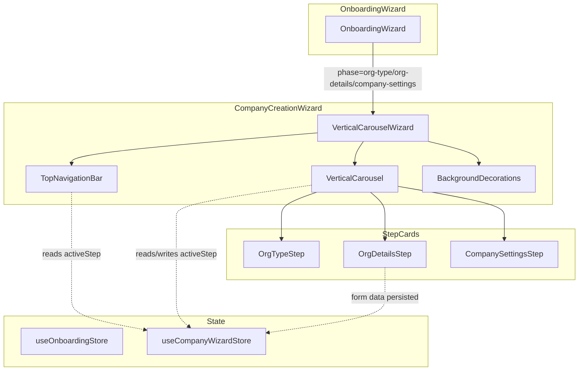

# Design Document: Company Creation Wizard

## Overview

This design replaces the current company creation flow (org-type → org-details → company-settings) — which renders steps as small constrained cards with overflow issues — with a vertical carousel layout matching the Figma specification (node 484:1744).

The key changes are:
1. **Vertical carousel**: Cards stack along the Y-axis with `translateY`-based transitions, showing an active card and a peek of the next card below
2. **Decoupled top navigation**: A fixed navigation bar rendered outside card content, providing consistent navigation arrows and step context
3. **Full-width cards**: Cards scale to 88.7% of viewport width (max 1341px) instead of the current constrained `max-w-3xl` (768px)
4. **Preserved step content**: All existing business logic (form validation, selections, store interactions) remains unchanged

The architecture closely mirrors the existing `RegistrationCarousel` pattern — CSS transforms driven by state, JS-animated mask transitions, responsive breakpoint adaptations — but oriented vertically.

## Architecture



### Design Decisions

1. **New wrapper component (`VerticalCarouselWizard`)** instead of modifying `OnboardingWizard` directly — keeps registration carousel logic isolated and avoids coupling concerns.

2. **Dedicated `useCompanyWizardStore`** slice for the carousel's internal state (activeStep, transitioning flag, form data) — separate from the existing `useOnboardingStore` which manages the overall phase. The phase store still drives entry/exit, but the carousel manages its own step index.

3. **CSS-driven layout + JS-animated masks** — same pattern as `RegistrationCarousel`. The track uses `transition: transform 500ms` on a single container that translates vertically. Mask/opacity animations run via `requestAnimationFrame` for smooth synchronization.

4. **TopNavigation rendered outside the carousel viewport** — avoids the current issue where `TopNavigation` is embedded inside each `Card` and moves with card transitions.

## Components and Interfaces

### VerticalCarouselWizard

Top-level orchestrator that composes the navigation bar, background, and carousel.

```typescript
interface VerticalCarouselWizardProps {
  /** Called when the wizard completes (last step submitted successfully) */
  onComplete: () => void
}
```

Responsibilities:
- Renders `TopNavigationBar`, `BackgroundDecorations`, and `VerticalCarousel`
- Reads `activeStep` from store to pass to navigation bar
- Provides `onAdvance` and `onBack` callbacks to carousel and nav bar

### TopNavigationBar

Fixed-position navigation bar decoupled from card content.

```typescript
interface TopNavigationBarProps {
  /** 0-based index of the currently active step */
  activeStep: number
  /** Total number of steps in the wizard */
  totalSteps: number
  /** Step labels for display (e.g., ["Organizzazione", "Dettagli", "Impostazioni"]) */
  stepLabels: string[]
  /** Called when user clicks the up (back) arrow */
  onBack?: () => void
  /** Called when user clicks the down (forward) arrow */
  onForward?: () => void
  /** Whether a transition is in progress (disables navigation) */
  isTransitioning?: boolean
}
```

Renders:
- Up/down navigation arrows (disabled at boundaries or during transitions)
- Step label: `"{stepLabels[activeStep]} / {activeStep + 1}"`
- Centered Flowlee logo
- User avatar icon (right side)

CSS positioning:
- `position: fixed; top: 0; left: 0; right: 0; z-index: 50`
- Padding top ~78px from viewport top (matching Figma)
- Height: ~60px content area

### VerticalCarousel

The carousel engine managing vertical card transitions.

```typescript
interface VerticalCarouselProps {
  /** 0-based active step index */
  activeStep: number
  /** Callback to advance to next step */
  onAdvance: () => void
  /** Callback to go back to previous step */
  onBack: () => void
  /** Children are the step components */
  children: React.ReactNode[]
}
```

Internal state:
- `transitioning: useRef<boolean>` — prevents double-advances during animation
- `cardRefs: useRef<(HTMLDivElement | null)[]>` — direct DOM access for mask animations
- `animFrameRef: useRef<number>` — cleanup for `requestAnimationFrame`

### VerticalCarouselCard

Wrapper for each step card providing the full-width card container styling.

```typescript
interface VerticalCarouselCardProps {
  /** Visual state of the card in the carousel */
  state: 'active' | 'peek' | 'above' | 'hidden'
  children: React.ReactNode
}
```

### BackgroundDecorations

Renders the two decorative planet/ellipse elements in the background.

```typescript
// No props — purely decorative, positioned via absolute/fixed CSS
function BackgroundDecorations(): JSX.Element
```

### useCompanyWizardStore

Zustand store managing wizard-internal state.

```typescript
interface CompanyWizardStore {
  /** 0-based active step index (0=org-type, 1=org-details, 2=company-settings) */
  activeStep: number
  /** Whether a transition animation is in progress */
  isTransitioning: boolean
  /** Form data preserved across step navigation */
  formData: {
    orgType: 'company' | 'freelance' | null
    orgDetails: { companyName: string; teamSize: string; description: string } | null
  }
  setActiveStep: (step: number) => void
  setTransitioning: (v: boolean) => void
  setOrgType: (type: 'company' | 'freelance') => void
  setOrgDetails: (data: { companyName: string; teamSize: string; description: string }) => void
  reset: () => void
}
```

Persisted to `sessionStorage` under key `flowlee-company-wizard` so that page refresh doesn't lose progress.

## Data Models

### Step Configuration

```typescript
const WIZARD_STEPS = [
  { id: 'org-type', label: 'Organizzazione' },
  { id: 'org-details', label: 'Dettagli' },
  { id: 'company-settings', label: 'Impostazioni' },
] as const

type WizardStepId = typeof WIZARD_STEPS[number]['id']
```

### Carousel Layout Configuration

```typescript
const VERTICAL_CAROUSEL_CONFIG = {
  /** Card starts at this Y offset from viewport top (Figma: 223px at 1512px viewport) */
  cardTopOffset: 223,
  /** Peek card starts at this Y offset (Figma: 799px at 1512px viewport) */
  peekTopOffset: 799,
  /** Navigation bar Y offset from viewport top (Figma: 78px) */
  navTopOffset: 78,
  /** Transition duration in ms */
  transitionDuration: 500,
  /** CSS easing function */
  easing: 'cubic-bezier(0.4, 0, 0.2, 1)',
  /** Peek card visible height in px */
  peekHeight: 80,
  /** Reference viewport width for proportional calculations */
  referenceViewport: 1512,
  /** Card width ratio relative to viewport (1341/1512) */
  cardWidthRatio: 0.887,
  /** Minimum card width in px */
  minCardWidth: 288,
  /** Mobile breakpoint */
  mobileBreakpoint: 768,
} as const
```

### Card Dimensions (derived at runtime)

```typescript
interface CardDimensions {
  width: number       // min(viewport * 0.887, 1341px), min 288px
  minHeight: number   // 536px
  topOffset: number   // proportionally scaled from reference
  peekOffset: number  // proportionally scaled from reference
  padding: {
    horizontal: number  // 40px desktop, 20px mobile
    vertical: number    // 32px desktop, 24px mobile
  }
  borderRadius: number  // 24px desktop, 16px mobile
}
```

## Error Handling

### Transition Guard

All navigation actions (advance/back) are guarded by the `isTransitioning` flag. If a transition is in progress, subsequent navigation requests are silently ignored. The flag is cleared after the 500ms transition via `setTimeout`.

### Resize During Transition

Per Requirement 4.4: if the viewport resizes mid-transition, the recalculation is deferred. A `ResizeObserver` or `resize` event listener queues dimension recalculation but only applies it after `isTransitioning` becomes false.

```typescript
// Pseudocode
useEffect(() => {
  const handler = () => {
    if (isTransitioning) {
      pendingResize.current = true
      return
    }
    recalculateDimensions()
  }
  window.addEventListener('resize', handler)
  return () => window.removeEventListener('resize', handler)
}, [isTransitioning])

// After transition completes:
if (pendingResize.current) {
  recalculateDimensions()
  pendingResize.current = false
}
```

### Form Validation Blocking

Step components (OrgDetailsStep, CompanySettingsStep) use `react-hook-form` with Zod schema validation. If validation fails, the step does NOT call `onAdvance()` — the carousel remains on the current step. Error messages render inline via existing `FormField` error prop.

### Animation Cleanup

The `animFrameRef` is cancelled on unmount via `useEffect` cleanup to prevent memory leaks and stale DOM references.

### Edge Cases

- **First step back**: `onBack` is not provided/called when `activeStep === 0`; the TopNavigationBar disables the up arrow.
- **Last step peek**: When `activeStep === 2` (company-settings), no peek card renders below.
- **SessionStorage corruption**: If `useCompanyWizardStore` encounters invalid persisted state, it falls back to defaults (`activeStep: 0`, null form data).

## Testing Strategy

### Why Property-Based Testing Does Not Apply

This feature is primarily a **UI rendering and layout** redesign:
- Vertical carousel transitions (CSS transforms, animations)
- Card sizing and responsive behavior
- Visual positioning matching Figma specifications
- Component decoupling (TopNavigation outside cards)

The existing business logic (form validation, store management) is preserved unchanged. The new code is predominantly layout/animation orchestration with no pure data transformations or algorithmic logic suitable for property-based testing.

**Appropriate testing strategies:**
- Snapshot tests for rendered component structure
- Example-based unit tests for state transitions and guards
- Integration tests for full wizard flow
- Visual regression tests (manual/Playwright) for Figma fidelity

### Unit Tests

| Test | What it verifies |
|------|-----------------|
| `VerticalCarousel` renders correct card states | Active card gets `state="active"`, next gets `state="peek"`, previous gets `state="above"` |
| Transition guard prevents double-advance | Calling `onAdvance` twice rapidly only advances once |
| `TopNavigationBar` disables up arrow on first step | `activeStep=0` → up arrow has `pointer-events: none` and reduced opacity |
| `TopNavigationBar` disables down arrow on last step | `activeStep=2` → down arrow disabled |
| Step label updates correctly | `activeStep=1` with labels → displays "Dettagli / 2" |
| Card dimensions compute correctly | Given viewport 1512px → width=1341px; given 900px → width=798px; given 320px → width=304px (clamped at 288 minimum) |
| Mobile breakpoint hides peek card | viewport < 768px → peek card not rendered |
| Form validation blocks advance | Invalid OrgDetailsStep submission does not trigger `onAdvance` |
| Resize during transition is deferred | Resize event while `isTransitioning=true` does not immediately recalculate |

### Integration Tests

| Test | What it verifies |
|------|-----------------|
| Full wizard flow (happy path) | OrgType selection → OrgDetails form → CompanySettings save → `onComplete` called |
| Back navigation preserves form data | Fill OrgDetails → go back → return → form data still populated |
| SessionStorage persistence | Set activeStep=1 → remount component → still on step 1 |
| Responsive layout at breakpoints | At 1512px, 768px, and 375px widths the layout matches expected structure |

### Manual/Visual Testing

- Compare rendered output against Figma node 484:1744 at 1512px viewport
- Verify transition animation smoothness (60fps target)
- Check decorative planet elements positioning
- Verify touch target sizes on mobile (44×44px minimum)
- Test with screen readers for accessibility of navigation state changes
