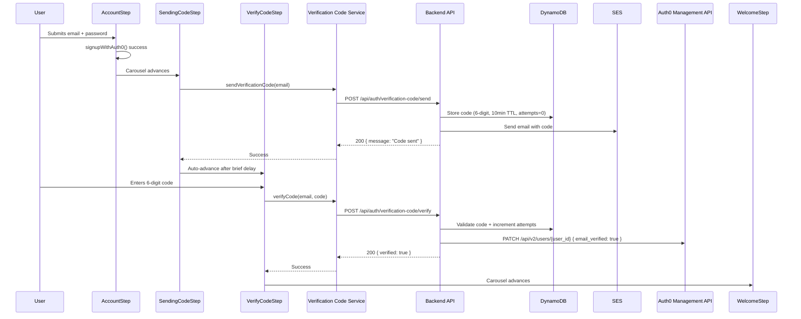

# Design Document: Email Verification Code

## Overview

This feature replaces the default Auth0 verification link email with a custom 6-digit code flow during signup. After the user creates an account via the embedded Auth0 signup, the backend generates a verification code, stores it in DynamoDB with a TTL, and sends it via SES. The user enters the code in the existing `VerifyCodeStep` UI component. On successful validation, the backend marks the email as verified in Auth0 via the Management API.

The frontend changes insert two new carousel steps (`SendingCodeStep` → `VerifyCodeStep`) between `AccountStep` and `WelcomeStep`, wire up a new verification-code API service, and handle error/retry states.

## Architecture



## Components and Interfaces

### 1. Verification Code Service (`src/features/auth/verification-code.ts`)

A standalone API client for the verification code backend endpoints. Follows the same pattern as `auth0-signup.ts`.

```typescript
// ─── Types ───────────────────────────────────────────────────────────────────

export interface SendCodeRequest {
  email: string;
}

export interface SendCodeResponse {
  message: string;
}

export interface VerifyCodeRequest {
  email: string;
  code: string;
}

export interface VerifyCodeSuccessResponse {
  verified: true;
}

export interface VerifyCodeErrorResponse {
  error: 'invalid_code' | 'expired_code' | 'max_attempts' | 'unknown_error';
}

// ─── Functions ───────────────────────────────────────────────────────────────

/**
 * Sends a verification code to the given email.
 * Always resolves (never throws for email enumeration safety).
 * In mock mode: resolves immediately without HTTP call.
 */
export async function sendVerificationCode(
  request: SendCodeRequest
): Promise<SendCodeResponse>;

/**
 * Verifies the code against the backend.
 * Resolves on success, throws VerifyCodeErrorResponse on failure.
 * In mock mode: resolves immediately if code is "123456", throws otherwise.
 */
export async function verifyCode(
  request: VerifyCodeRequest
): Promise<VerifyCodeSuccessResponse>;
```

**Implementation details:**
- Base URL derived from `env.VITE_API_BASE_URL`
- `sendVerificationCode`: POST to `/api/auth/verification-code/send` — always resolves with `{ message: "Code sent" }` regardless of backend response (avoids leaking whether email exists)
- `verifyCode`: POST to `/api/auth/verification-code/verify` — resolves on 200 with `{ verified: true }`, throws typed error on 400
- Network failures throw with `error: 'unknown_error'`

### 2. SendingCodeStep Modifications (`src/features/onboarding/steps/SendingCodeStep.tsx`)

Current state: Static UI with avatar, "sending code" text, manual Next button.

**Changes:**
- Accept `email` prop to display the actual user email
- Call `sendVerificationCode(email)` on mount via `useEffect`
- Show loading animation while API call is in progress
- Auto-advance to `VerifyCodeStep` after a brief delay (1.5s min display time for UX)
- Remove the manual "Next" button (step auto-advances)
- Handle send failure gracefully (still advance — user can resend from next step)

```typescript
interface SendingCodeStepProps {
  onNext: () => void;
  email: string;
}
```

### 3. VerifyCodeStep Modifications (`src/features/onboarding/steps/VerifyCodeStep.tsx`)

Current state: Static UI with hardcoded email, uncontrolled input, non-functional buttons.

**Changes:**
- Accept `email` prop to display the actual user email
- Use `react-hook-form` for the code input (validation: exactly 6 digits)
- Wire "Confirm" button to call `verifyCode(email, code)`
- Wire "Resend" button to call `sendVerificationCode(email)` with cooldown (30s)
- Display inline error messages for invalid/expired code
- Loading state on submit (disable buttons, show spinner)
- On success: call `onNext()` to advance carousel
- On max attempts error: show specific message, disable input

```typescript
interface VerifyCodeStepProps {
  onNext: () => void;
  email: string;
}
```

### 4. RegistrationCarousel Flow Changes

**Current flow** (when `includeAccountStep=true`):
```
AccountStep → WelcomeStep → PersonalInfoStep → RoleStep → PhotoUploadStep
```

**New flow** (when `includeAccountStep=true`):
```
AccountStep → SendingCodeStep → VerifyCodeStep → WelcomeStep → PersonalInfoStep → RoleStep → PhotoUploadStep
```

**Implementation:**
- Update `totalSteps` from 5 to 7 (when `includeAccountStep=true`)
- Update `welcomeStepIndex` from 1 to 3
- Insert `SendingCodeStep` at index 1 and `VerifyCodeStep` at index 2
- Pass `signupEmail` from the onboarding store to both new steps
- Update all subsequent index calculations (`personalInfoIndex`, `roleIndex`, `photoIndex`)

### 5. Onboarding Store Extension

Add verification state tracking:

```typescript
interface OnboardingStore {
  // ... existing fields ...
  signupEmail: string | null;        // Already exists
  emailVerified: boolean;            // NEW — tracks verification status
  setEmailVerified: (v: boolean) => void;  // NEW
}
```

The `emailVerified` flag allows the carousel to optionally skip verification steps if the user returns to onboarding after already verifying (edge case: browser refresh during carousel).

## Data Models

### Backend Request: Send Code

```json
POST /api/auth/verification-code/send
Content-Type: application/json

{
  "email": "user@example.com"
}
```

### Backend Response: Send Code (always 200)

```json
{
  "message": "Code sent"
}
```

### Backend Request: Verify Code

```json
POST /api/auth/verification-code/verify
Content-Type: application/json

{
  "email": "user@example.com",
  "code": "482917"
}
```

### Backend Response: Verify Success (200)

```json
{
  "verified": true
}
```

### Backend Response: Verify Failure (400)

```json
{
  "error": "invalid_code"
}
```

Possible `error` values:
- `invalid_code` — code doesn't match
- `expired_code` — code TTL exceeded (10 minutes)
- `max_attempts` — 5 failed attempts, code invalidated

### DynamoDB Record (Backend — documented for contract clarity)

```json
{
  "pk": "VERIFY#user@example.com",
  "code": "482917",
  "attempts": 0,
  "ttl": 1719500000,
  "created_at": "2024-06-27T10:00:00Z"
}
```

## Error Handling

| Scenario | Error Code | User-Facing Message (i18n key) | Behavior |
|----------|-----------|-------------------------------|----------|
| Invalid code entered | `invalid_code` | `verification.errors.invalid_code` | Show error, allow retry |
| Code expired (>10min) | `expired_code` | `verification.errors.expired_code` | Show error, prompt resend |
| Max attempts (5) reached | `max_attempts` | `verification.errors.max_attempts` | Disable input, prompt resend |
| Network failure on verify | `unknown_error` | `verification.errors.network_error` | Show error, allow retry |
| Network failure on send | (swallowed) | (none — still advance) | Log warning, user can resend |
| Send rate-limited (429) | (swallowed) | (none) | Backend handles; always returns 200 |

**Resend cooldown:**
- 30-second cooldown between resend attempts (frontend-enforced)
- "Resend" button shows countdown timer during cooldown
- After cooldown expires, button re-enables

**Mock mode behavior:**
- `sendVerificationCode`: resolves immediately, no HTTP call
- `verifyCode`: accepts code `"123456"` as valid, rejects anything else with `invalid_code`

## Testing Strategy

**Unit Tests:**
- `verification-code.ts`: Mock fetch, test success/error response handling, mock mode behavior
- `SendingCodeStep`: Test auto-advance behavior, email display, API call on mount
- `VerifyCodeStep`: Test form validation (6-digit only), error display, resend cooldown, loading states
- `RegistrationCarousel`: Test new step sequence with 7 steps, correct index calculations

**Integration Tests:**
- Full carousel flow: AccountStep → SendingCodeStep → VerifyCodeStep → WelcomeStep (verify code `123456` in mock mode)
- Error recovery: enter wrong code → see error → enter correct code → advance
- Resend flow: click resend → cooldown timer → resend enabled

**Approach:**
- Property-based testing is NOT applicable to this feature. The logic involves:
  - External API calls (backend endpoints) — not suitable for PBT
  - UI rendering and state transitions — not suitable for PBT
  - Simple request/response validation — better covered by example-based tests
- Use example-based unit tests with `vitest` and `@testing-library/react`
- Use MSW or manual fetch mocks for the API client tests

## Performance Considerations

- `SendingCodeStep` uses a minimum display time of 1.5s to prevent jarring flash-through UX
- The send API call and minimum display time run in parallel (`Promise.all` with a delay)
- Code input is debounce-free (user submits explicitly via Confirm button)

## Security Considerations

- **No email enumeration**: Send endpoint always returns 200 regardless of whether email exists
- **Rate limiting**: Backend enforces rate limits on send endpoint (not frontend responsibility)
- **Max attempts**: 5 verification attempts before code is invalidated
- **TTL**: Codes expire after 10 minutes
- **Unauthenticated endpoints**: Both endpoints are public (user hasn't logged in yet) — protected by rate limiting only
- **No code in URL**: Code is submitted via POST body, never in query params or URLs

## Correctness Properties

*A property is a characteristic or behavior that should hold true across all valid executions of a system — essentially, a formal statement about what the system should do. Properties serve as the bridge between human-readable specifications and machine-verifiable correctness guarantees.*

### Property 1: sendVerificationCode never throws

*For any* HTTP response status code returned by the backend (200, 400, 404, 500, or network failure), the `sendVerificationCode` function SHALL always resolve successfully and never throw an exception.

**Validates: Requirements 1.3, 1.4**

### Property 2: verifyCode maps backend errors to typed error codes

*For any* 400-level response from the backend containing an `error` field with value in `{ "invalid_code", "expired_code", "max_attempts" }`, the `verifyCode` function SHALL throw an error object whose `error` field exactly matches the backend response value.

**Validates: Requirements 1.6**

### Property 3: Mock mode rejects all non-magic codes

*For any* code string that is not exactly `"123456"`, calling `verifyCode` in mock mode SHALL throw an error with `error: "invalid_code"`.

**Validates: Requirements 2.3**

### Property 4: Code input validation accepts only 6-digit strings

*For any* input string, the code validation logic SHALL accept the input if and only if it matches the pattern of exactly 6 numeric digits (`/^\d{6}$/`). All other strings (shorter, longer, containing non-digits, empty) SHALL be rejected.

**Validates: Requirements 4.2**

## Dependencies

- Existing: `react-hook-form`, `i18next`, `zustand`
- Backend (separate repo): AWS Lambda, DynamoDB, SES, Auth0 Management API
- New env variable: `VITE_API_BASE_URL` (already exists in the codebase for other API calls)
