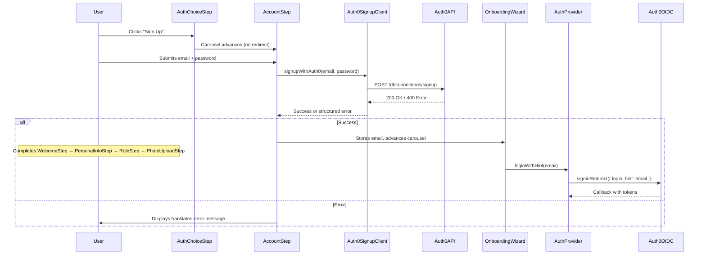

# Design Document: Embedded Auth0 Signup

## Overview

This feature embeds the Auth0 account creation flow directly within the onboarding carousel, replacing the external redirect for signup. The user stays within the familiar carousel UI, submits email/password via the existing `AccountStep`, and the system calls Auth0's `/dbconnections/signup` REST endpoint. On success, the carousel continues through remaining steps. When the carousel completes, the system triggers an OIDC `signinRedirect` with `login_hint` so the user doesn't need to re-enter their email on the Auth0 login page.

## Architecture



## Components and Interfaces

### 1. Auth0 Signup Client (`src/features/auth/auth0-signup.ts`)

A standalone module responsible for calling the Auth0 Database Connections signup endpoint.

```typescript
// Types
export interface Auth0SignupRequest {
  email: string;
  password: string;
}

export interface Auth0SignupSuccess {
  _id: string;
  email: string;
  email_verified: boolean;
}

export interface Auth0SignupError {
  code: string;
  description: string;
  statusCode: number;
}

// Main function
export async function signupWithAuth0(
  request: Auth0SignupRequest
): Promise<Auth0SignupSuccess>;
```

**Implementation details:**
- Derives the Auth0 domain from `env.VITE_AUTH_AUTHORITY` (strips the `https://` prefix if needed)
- Uses `env.VITE_AUTH_CLIENT_ID` as the `client_id` parameter
- Sets `connection: "Username-Password-Authentication"` 
- On HTTP 200: resolves with `Auth0SignupSuccess`
- On HTTP 400+: throws a typed `Auth0SignupError` parsed from the response body
- On network failure: throws with `code: "network_error"`

### 2. AuthProvider Enhancement (`loginWithHint`)

Add a new method to `AuthContextValue`:

```typescript
export interface AuthContextValue {
  // ... existing methods ...
  loginWithHint(email: string, returnTo?: string): void;
}
```

**Implementation:**
- Calls `mgr.signinRedirect({ state: returnTo, extraQueryParams: { audience, login_hint: email } })`
- Includes the existing `audience` parameter alongside `login_hint`
- Uses the same `guardedRedirectToLogin` pattern for consistency

### 3. Onboarding Store Extension

Add `signupEmail` field to track the email used during embedded signup:

```typescript
interface OnboardingStore {
  // ... existing fields ...
  signupEmail: string | null;
  setSignupEmail: (email: string | null) => void;
}
```

This field is stored in session storage (like other onboarding state) so it survives the OIDC redirect round-trip if needed, though primarily it's used in-memory before the redirect.

### 4. AccountStep Modifications

The existing `AccountStep` component gains:
- An `onSignupSuccess(email: string)` callback prop (or calls the store directly)
- Integration with `Auth0SignupClient` on form submit
- Loading state (disables button, shows spinner)
- Error display for Auth0 error codes mapped to i18n keys
- Mock mode bypass: in mock mode, skip the HTTP call and advance directly

### 5. RegistrationCarousel Flow Change

New step sequence when signup is chosen:
```
AuthChoiceStep → AccountStep → WelcomeStep → PersonalInfoStep → RoleStep → PhotoUploadStep
```

The carousel must conditionally include `AccountStep` only when the user selected signup (not login). This is achieved by:
- `OnboardingWizard` entering a "signup flow" state when user clicks "Sign Up"
- Instead of calling `signup()` (which triggers redirect), it renders the `RegistrationCarousel` with an `includeAccountStep` prop
- The carousel inserts `AccountStep` as the first step before `WelcomeStep`

### 6. OnboardingWizard Changes

When the user is unauthenticated and clicks "Sign Up":
1. Set a local state flag `showSignupCarousel = true` 
2. Render `RegistrationCarousel` with `includeAccountStep={true}`
3. When carousel completes (`onComplete`), call `authContext.loginWithHint(signupEmail, '/onboarding')`

### 7. Error Mapping (`src/features/auth/auth0-error-map.ts`)

Maps Auth0 error codes to i18n translation keys:

```typescript
const AUTH0_ERROR_MAP: Record<string, string> = {
  'user_exists': 'auth.errors.email_already_registered',
  'password_strength_error': 'auth.errors.password_too_weak',
  'password_no_user_info_error': 'auth.errors.password_contains_user_info',
  'password_dictionary_error': 'auth.errors.password_too_common',
  'invalid_password': 'auth.errors.invalid_password',
  'invalid_signup': 'auth.errors.invalid_signup',
  'network_error': 'auth.errors.network_error',
};

export function mapAuth0Error(code: string, description?: string): string;
```

For `password_strength_error`, the `description` from Auth0 contains the specific policy detail (e.g., "Password is too weak") which should be appended or used as a fallback.

## Data Models

### Auth0 Signup Request (outbound)

```json
{
  "client_id": "<VITE_AUTH_CLIENT_ID>",
  "email": "user@example.com",
  "password": "SecureP@ss1",
  "connection": "Username-Password-Authentication"
}
```

### Auth0 Signup Response — Success (HTTP 200)

```json
{
  "_id": "64a...",
  "email": "user@example.com",
  "email_verified": false
}
```

### Auth0 Signup Response — Error (HTTP 400)

```json
{
  "code": "user_exists",
  "description": "The user already exists.",
  "statusCode": 400
}
```

### Extended Onboarding Store State

```typescript
{
  phase: 'registration',
  activeStep: 0,
  selectedRole: null,
  signupEmail: null  // NEW — stores email after successful signup
}
```

## Error Handling

| Scenario | Auth0 Code | User-Facing Message (i18n key) |
|----------|-----------|-------------------------------|
| Email already registered | `user_exists` | `auth.errors.email_already_registered` |
| Password too weak | `password_strength_error` | `auth.errors.password_too_weak` (+ Auth0 description) |
| Password contains user info | `password_no_user_info_error` | `auth.errors.password_contains_user_info` |
| Password too common | `password_dictionary_error` | `auth.errors.password_too_common` |
| Invalid password format | `invalid_password` | `auth.errors.invalid_password` |
| Signup disabled / invalid | `invalid_signup` | `auth.errors.invalid_signup` |
| Network failure | `network_error` | `auth.errors.network_error` |
| Unknown error | (fallback) | `auth.errors.generic` |

**Error display behavior:**
- Errors appear inline above the submit button
- Form data is preserved so the user can correct and retry
- The submit button is re-enabled after error display
- Loading spinner is hidden on error

**Mock mode:**
- `signupWithAuth0()` checks `isMockMode()` internally and resolves immediately with a fake success response
- No network call is made in mock mode

## Testing Strategy

**Unit Tests:**
- `auth0-signup.ts`: Mock fetch, test success/error response parsing, test network error handling
- `auth0-error-map.ts`: Test all known error codes map to correct i18n keys, test fallback for unknown codes
- `AccountStep`: Render tests for loading state, error display, mock mode bypass
- `RegistrationCarousel`: Test that `includeAccountStep` prop correctly includes/excludes the step
- `AuthProvider.loginWithHint`: Test that signinRedirect is called with correct `login_hint` and `audience`

**Integration Tests:**
- Full carousel flow: AuthChoiceStep → AccountStep → remaining steps → loginWithHint triggered
- Error recovery: submit → error → fix → resubmit → success

**Approach:**
- Property-based testing is NOT applicable to this feature. The logic involves:
  - External API calls (Auth0 endpoint) — not suitable for PBT
  - UI rendering and state transitions — not suitable for PBT  
  - A small deterministic error code mapping — better covered by example-based tests with all known codes
- Use example-based unit tests with `vitest` and `@testing-library/react` for component tests
- Use MSW (Mock Service Worker) or manual fetch mocks for the signup client tests
