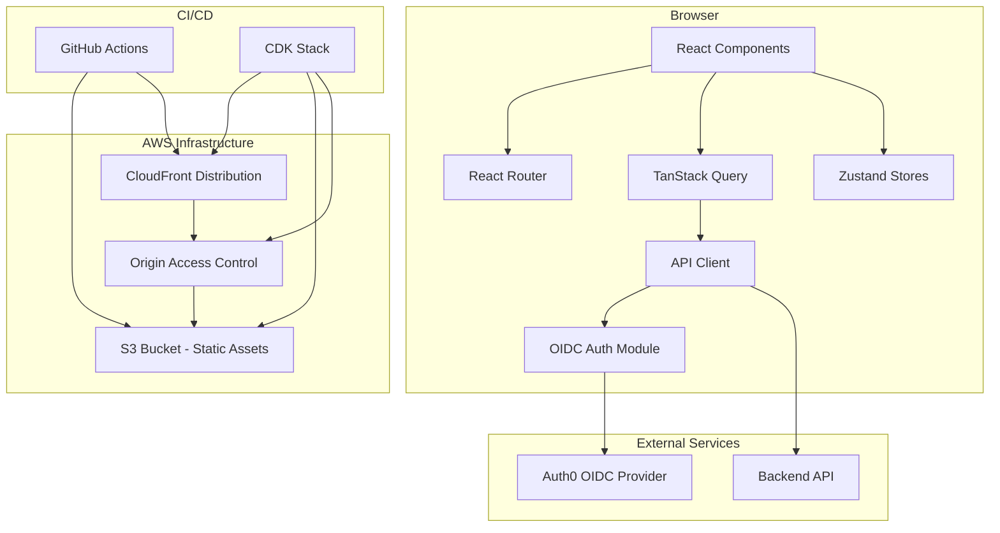
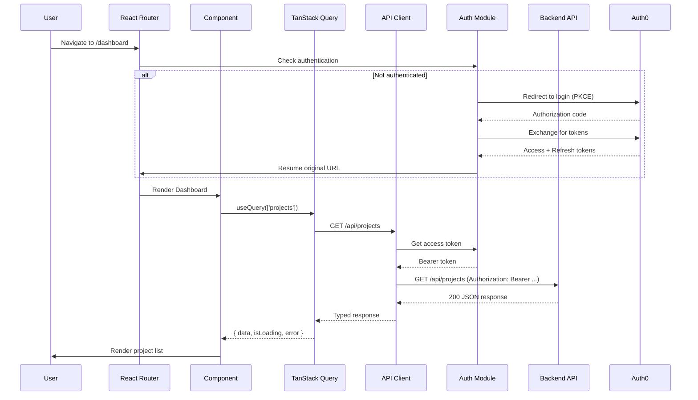
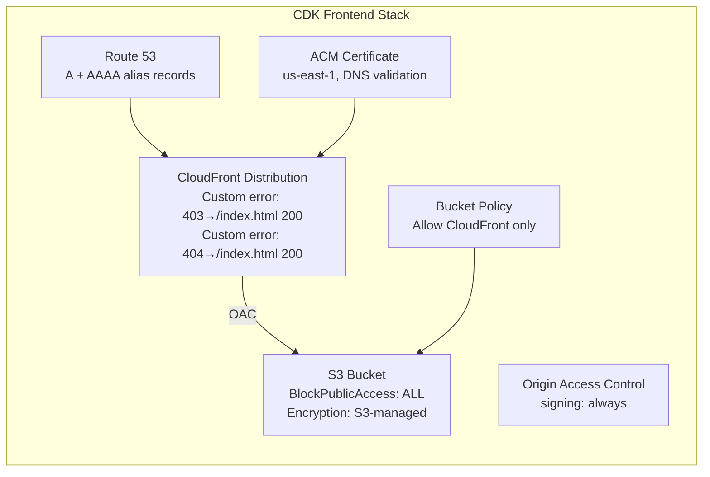
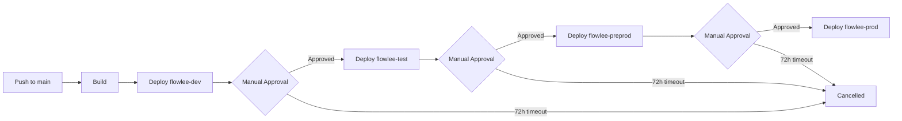

# Design Document: Frontend Audit & Backend Integration

## Overview

This design addresses the comprehensive audit and remediation of the Flowlee frontend repository to prepare it for backend integration. The current state is a prototype-quality React SPA with all UI logic in a single 1300+ line `App.tsx`, relying on mixed tooling, and lacking routing, API layer, state management, authentication, and deployment infrastructure.

The remediation transforms this into a production-ready frontend with:
- npm as sole package manager with deterministic lockfile
- Clean project structure organized by feature
- React Router-based routing with auth guards
- Typed fetch-based API client with token lifecycle
- TanStack Query for server state, Zustand for client state
- Auth0 OIDC authentication via Authorization Code + PKCE
- AWS CDK infrastructure (S3 + CloudFront + OAC) across 4 stages
- GitHub Actions CI/CD pipeline with approval gates

**Target users:** Flowlee development team (3-5 developers), DevOps engineers managing deployments.

**Key design decisions:**
1. Feature-based directory structure over flat/type-based — colocates related code, scales horizontally
2. Single route config file — single source of truth, easier to audit and maintain
3. Thin API client (no Axios) — fewer dependencies, full control over token lifecycle
4. TanStack Query + Zustand split — clear server/client state boundary, avoids cache duplication
5. CDK over raw CloudFormation — type safety, reusable constructs, better DX for the team

---

## Architecture

### High-Level System Diagram



### Data Flow



---

## Components and Interfaces

### Project Structure (Target)

```
flowlee-frontend/
├── index.html
├── package.json
├── package-lock.json
├── vite.config.ts
├── tsconfig.json
├── tsconfig.app.json
├── .env.example
├── .kiro/
│   ├── steering/
│   │   └── no-quality-tooling.md
│   └── specs/
├── docs/
│   ├── architecture.md
│   └── deployment.md
├── infra/
│   ├── cdk.json
│   ├── package.json
│   ├── tsconfig.json
│   └── lib/
│       └── frontend-stack.ts
├── .github/
│   └── workflows/
│       └── deploy.yml
├── public/
│   ├── favicon.svg
│   └── icons.svg
└── src/
    ├── main.tsx
    ├── App.tsx                    # Root providers only
    ├── index.css
    ├── env.ts                    # Environment validation
    ├── routes.tsx                 # Single route config
    ├── components/
    │   └── ui/
    │       └── Button.tsx
    ├── features/
    │   ├── onboarding/
    │   │   ├── components/
    │   │   ├── steps/
    │   │   ├── store.ts          # Zustand store
    │   │   ├── types.ts
    │   │   └── OnboardingWizard.tsx
    │   ├── auth/
    │   │   ├── auth-provider.tsx  # OIDC context
    │   │   ├── auth-guard.tsx     # Route guard component
    │   │   ├── callback.tsx       # OIDC callback handler
    │   │   └── store.ts          # Auth token state
    │   └── dashboard/
    │       ├── components/
    │       ├── hooks/
    │       └── store.ts
    ├── lib/
    │   ├── api-client.ts         # Typed fetch wrapper
    │   ├── query-client.ts       # TanStack Query config
    │   └── i18n.ts               # i18next setup
    └── stores/
        └── ui-store.ts           # Global UI state (sidebar, theme)
```

### Component Hierarchy (Root)

```typescript
// src/App.tsx — Application shell with providers
<StrictMode>
  <AuthProvider>
    <QueryClientProvider client={queryClient}>
      <BrowserRouter>
        <AppRoutes />
      </BrowserRouter>
    </QueryClientProvider>
  </AuthProvider>
</StrictMode>
```

### API Client Interface

```typescript
// src/lib/api-client.ts

/** Structured error thrown by the API client */
export interface ApiError {
  status: number | null;       // null for network errors
  message: string;
  url: string;
  method: string;
}

/** Options for API requests */
interface RequestOptions<TBody = unknown> {
  method: 'GET' | 'POST' | 'PUT' | 'PATCH' | 'DELETE';
  path: string;
  body?: TBody;
  headers?: Record<string, string>;
  requireAuth?: boolean;       // default: true
}

/** Core API client */
export const apiClient = {
  get<TResponse>(path: string, options?: { requireAuth?: boolean }): Promise<TResponse>;
  post<TResponse, TBody = unknown>(path: string, body: TBody, options?: { requireAuth?: boolean }): Promise<TResponse>;
  put<TResponse, TBody = unknown>(path: string, body: TBody, options?: { requireAuth?: boolean }): Promise<TResponse>;
  patch<TResponse, TBody = unknown>(path: string, body: TBody, options?: { requireAuth?: boolean }): Promise<TResponse>;
  delete<TResponse>(path: string, options?: { requireAuth?: boolean }): Promise<TResponse>;
};
```

### Auth Module Interface

```typescript
// src/features/auth/auth-provider.tsx

interface AuthContext {
  isAuthenticated: boolean;
  isLoading: boolean;
  user: OidcUser | null;
  getAccessToken(): string | null;
  login(returnTo?: string): void;
  logout(): void;
  silentRefresh(): Promise<boolean>;
}

interface OidcUser {
  sub: string;
  email: string;
  name: string;
}

interface AuthConfig {
  authority: string;        // VITE_AUTH_AUTHORITY
  clientId: string;         // VITE_AUTH_CLIENT_ID
  redirectUri: string;      // window.location.origin + '/auth/callback'
  postLogoutRedirectUri: string;
  scope: string;            // 'openid profile email'
}
```

### Route Configuration Interface

```typescript
// src/routes.tsx

interface RouteDefinition {
  path: string;
  component: React.LazyExoticComponent<React.FC>;
  isPublic: boolean;
  label?: string;            // for navigation display
}

// Single source of truth for all routes
export const routes: RouteDefinition[] = [
  { path: '/',              component: lazy(() => import('./features/onboarding/OnboardingWizard')), isPublic: true },
  { path: '/auth/callback', component: lazy(() => import('./features/auth/callback')),              isPublic: true },
  { path: '/dashboard',     component: lazy(() => import('./features/dashboard/Dashboard')),        isPublic: false },
  // ... all other routes
];
```

### TanStack Query Configuration

```typescript
// src/lib/query-client.ts

import { QueryClient } from '@tanstack/react-query';

export const queryClient = new QueryClient({
  defaultOptions: {
    queries: {
      staleTime: 5 * 60 * 1000,    // 5 minutes
      retry: 3,
      refetchOnWindowFocus: false,
    },
    mutations: {
      retry: 0,
    },
  },
});
```

### Zustand Store Pattern

```typescript
// src/features/onboarding/store.ts

import { create } from 'zustand';

interface OnboardingStore {
  activeStep: number;
  selectedRole: string | null;
  setActiveStep: (step: number) => void;
  setSelectedRole: (role: string | null) => void;
  reset: () => void;
}

export const useOnboardingStore = create<OnboardingStore>((set) => ({
  activeStep: 0,
  selectedRole: null,
  setActiveStep: (step) => set({ activeStep: step }),
  setSelectedRole: (role) => set({ selectedRole: role }),
  reset: () => set({ activeStep: 0, selectedRole: null }),
}));
```

### Environment Validation

```typescript
// src/env.ts

interface AppEnv {
  VITE_API_BASE_URL: string;
  VITE_AUTH_AUTHORITY: string;
  VITE_AUTH_CLIENT_ID: string;
}

function validateEnv(): AppEnv {
  const required = ['VITE_API_BASE_URL', 'VITE_AUTH_AUTHORITY', 'VITE_AUTH_CLIENT_ID'] as const;
  const missing = required.filter((key) => !import.meta.env[key]);

  if (missing.length > 0) {
    throw new Error(
      `Missing required environment variables: ${missing.join(', ')}. ` +
      `See .env.example for reference.`
    );
  }

  return {
    VITE_API_BASE_URL: import.meta.env.VITE_API_BASE_URL,
    VITE_AUTH_AUTHORITY: import.meta.env.VITE_AUTH_AUTHORITY,
    VITE_AUTH_CLIENT_ID: import.meta.env.VITE_AUTH_CLIENT_ID,
  };
}

export const env = validateEnv();
```

---

## Data Models

### API Error Model

```typescript
export interface ApiError {
  status: number | null;
  message: string;
  url: string;
  method: string;
}
```

### Auth Token Model (in-memory only)

```typescript
interface TokenState {
  accessToken: string | null;
  refreshToken: string | null;
  expiresAt: number | null;      // Unix timestamp ms
  idToken: string | null;
}
```

### Route Definition Model

```typescript
interface RouteDefinition {
  path: string;
  component: React.LazyExoticComponent<React.ComponentType>;
  isPublic: boolean;
  label?: string;
}
```

### CDK Stack Props

```typescript
interface FrontendStackProps extends cdk.StackProps {
  stage: 'flowlee-dev' | 'flowlee-test' | 'flowlee-preprod' | 'flowlee-prod';
  domainName: string;
  hostedZoneId: string;
  certificateArn?: string;       // if pre-provisioned
}
```

### Pipeline Stage Configuration

```typescript
interface StageConfig {
  name: string;
  awsAccountId: string;
  region: string;
  domainName: string;
  envVars: {
    VITE_API_BASE_URL: string;
    VITE_AUTH_AUTHORITY: string;
    VITE_AUTH_CLIENT_ID: string;
  };
  autoDeployOnMerge: boolean;
  requiresApproval: boolean;
  approvalTimeout: '72h';
}
```

---

## Error Handling

### API Client Error Strategy

| Scenario | Action |
|----------|--------|
| Response 401 | Attempt silent token refresh → retry request → if retry 401, redirect to login |
| Response 4xx (non-401) | Throw `ApiError` with status, message, url, method |
| Response 5xx | Throw `ApiError` with status, message, url, method |
| Network error (no response) | Throw `ApiError` with `status: null`, native error message |
| Missing env var at build time | Throw at module init, build fails |

### TanStack Query Error Propagation

- Failed queries after 3 retries: error state exposed to component via `useQuery().error`
- Failed mutations (0 retries): error state exposed immediately via `useMutation().error`
- Components render error UI based on `isError` / `error` fields
- No global error boundary for API errors — each feature handles its own errors contextually

### Auth Error Handling

| Scenario | Action |
|----------|--------|
| Token expired during request | API client triggers silent refresh, retries once |
| Silent refresh fails | Discard tokens, redirect to Auth0 login |
| Callback error (invalid code) | Redirect to login with error param |
| User navigates to guarded route unauthenticated | Redirect to login, persist original URL |

### Build Pipeline Error Handling

- Missing environment variables: build step fails with explicit message naming the missing variable
- `npm ci` failure: pipeline halts, no deploy
- `npm run build` failure: pipeline halts, no deploy
- S3 sync failure: pipeline halts, reports in workflow summary
- CloudFront invalidation failure: pipeline reports warning but does not block (cache expires naturally)
- Approval timeout (72h): pending deployment cancelled automatically

---

## Testing Strategy

### Why PBT Does Not Apply

This feature is primarily Infrastructure as Code (CDK), CI/CD pipeline configuration, project structure reorganization, and integration wiring. These are not pure functions with varying inputs — they are declarative configurations and one-time setup operations. Property-based testing is not appropriate because:

1. CDK stacks are declarative IaC — validated via snapshot tests and `cdk synth` assertions
2. Pipeline configuration is YAML — validated by dry-run and integration tests
3. API client error handling involves network I/O — tested with mock-based unit tests
4. Auth flow involves external OIDC provider — tested with example-based integration tests
5. Project structure requirements are file existence checks — verified by smoke tests

### Recommended Testing Approach

**Unit Tests (example-based):**
- API client: mock `fetch`, test each error scenario (401 retry, 4xx, 5xx, network error)
- Environment validation: test with/without required vars
- Route guard: test authenticated vs unauthenticated render
- Zustand stores: test action functions produce expected state transitions

**Integration Tests:**
- Auth flow: mock Auth0 responses, test full login/logout/refresh lifecycle
- TanStack Query hooks: test cache invalidation after mutations
- Route reachability: render each route, verify component mounts

**Infrastructure Tests:**
- CDK: `cdk synth` + CDK assertions library (`Template.fromStack()`)
- Verify S3 bucket has BlockPublicAccess
- Verify CloudFront has OAC configured
- Verify custom error responses for 403/404
- Verify stack outputs (distribution domain, bucket name)

**Smoke Tests:**
- `npm install && npm run build` exits 0
- No `bun.lock`, `bun.lockb`, `yarn.lock`, or `pnpm-lock.yaml` present
- All required files exist in expected paths
- `.env.example` lists all required variables

**Pipeline Tests:**
- GitHub Actions workflow syntax validation (`actionlint`)
- Dry-run approval gate configuration

---

## CDK Infrastructure Design

### Stack Architecture



### Key CDK Constructs

```typescript
// infra/lib/frontend-stack.ts

export class FrontendStack extends cdk.Stack {
  constructor(scope: Construct, id: string, props: FrontendStackProps) {
    super(scope, id, props);

    // S3 Bucket — block all public access, SSE-S3
    const bucket = new s3.Bucket(this, 'AssetsBucket', {
      bucketName: `flowlee-${props.stage}-frontend-assets`,
      blockPublicAccess: s3.BlockPublicAccess.BLOCK_ALL,
      encryption: s3.BucketEncryption.S3_MANAGED,
      removalPolicy: cdk.RemovalPolicy.RETAIN,
    });

    // OAC
    const oac = new cloudfront.CfnOriginAccessControl(this, 'OAC', {
      originAccessControlConfig: {
        name: `flowlee-${props.stage}-oac`,
        originAccessControlOriginType: 's3',
        signingBehavior: 'always',
        signingProtocol: 'sigv4',
      },
    });

    // CloudFront Distribution
    const distribution = new cloudfront.Distribution(this, 'Distribution', {
      defaultBehavior: {
        origin: new origins.S3BucketOrigin(bucket),
        viewerProtocolPolicy: cloudfront.ViewerProtocolPolicy.REDIRECT_TO_HTTPS,
      },
      defaultRootObject: 'index.html',
      errorResponses: [
        { httpStatus: 403, responseHttpStatus: 200, responsePagePath: '/index.html', ttl: cdk.Duration.seconds(0) },
        { httpStatus: 404, responseHttpStatus: 200, responsePagePath: '/index.html', ttl: cdk.Duration.seconds(0) },
      ],
      domainNames: [props.domainName],
      certificate: acm.Certificate.fromCertificateArn(this, 'Cert', props.certificateArn!),
    });

    // Route 53 alias records
    new route53.ARecord(this, 'AliasA', {
      zone: route53.HostedZone.fromHostedZoneId(this, 'Zone', props.hostedZoneId),
      recordName: props.domainName,
      target: route53.RecordTarget.fromAlias(new targets.CloudFrontTarget(distribution)),
    });

    // Stack outputs
    new cdk.CfnOutput(this, 'DistributionDomain', { value: distribution.distributionDomainName });
    new cdk.CfnOutput(this, 'BucketName', { value: bucket.bucketName });
  }
}
```

---

## CI/CD Pipeline Design

### Pipeline Stages



### GitHub Actions Workflow Structure

```yaml
# .github/workflows/deploy.yml
name: Build & Deploy

on:
  push:
    branches: [main]

jobs:
  build:
    runs-on: ubuntu-latest
    steps:
      - uses: actions/checkout@v4
      - uses: actions/setup-node@v4
        with:
          node-version: '20'
      - run: npm ci
      - run: npm run build
        env:
          VITE_API_BASE_URL: ${{ vars.DEV_API_BASE_URL }}
          VITE_AUTH_AUTHORITY: ${{ vars.DEV_AUTH_AUTHORITY }}
          VITE_AUTH_CLIENT_ID: ${{ vars.DEV_AUTH_CLIENT_ID }}
      - uses: actions/upload-artifact@v4
        with:
          name: dist
          path: dist/

  deploy-dev:
    needs: build
    runs-on: ubuntu-latest
    environment: flowlee-dev
    steps:
      - uses: actions/download-artifact@v4
      - run: aws s3 sync dist/ s3://${{ vars.S3_BUCKET }} --delete
      - run: aws cloudfront create-invalidation --distribution-id ${{ vars.CF_DISTRIBUTION_ID }} --paths "/*"

  deploy-test:
    needs: deploy-dev
    runs-on: ubuntu-latest
    environment:
      name: flowlee-test
      # GitHub environment protection rules handle approval + 72h timeout
    steps:
      # Rebuild with test env vars, sync, invalidate

  deploy-preprod:
    needs: deploy-test
    runs-on: ubuntu-latest
    environment:
      name: flowlee-preprod
    steps:
      # Rebuild with preprod env vars, sync, invalidate

  deploy-prod:
    needs: deploy-preprod
    runs-on: ubuntu-latest
    environment:
      name: flowlee-prod
    steps:
      # Rebuild with prod env vars, sync, invalidate
```

### Stage Environment Mapping

| Stage | Domain | Auto-deploy | Approval Required |
|-------|--------|-------------|-------------------|
| flowlee-dev | dev.flowlee.com | Yes (on merge to main) | No |
| flowlee-test | test.flowlee.com | No | Yes (1 approver) |
| flowlee-preprod | preprod.flowlee.com | No | Yes (1 approver) |
| flowlee-prod | app.flowlee.com | No | Yes (1 approver) |

---

## Steering Document Design

### No-Quality-Tooling Steering

```markdown
---
inclusion: auto
---

# No Quality Tooling Policy

## Policy
This project intentionally operates without automated quality gates during this phase.

## Prohibited
- Test runners: Vitest, Jest, Playwright, Cypress
- Linters: ESLint, Biome, stylelint
- Formatters: Prettier, Biome
- Type-check scripts: `tsc --noEmit`
- Pre-commit hooks: Husky, lint-staged
- Commit linters: commitlint

## Instructions for AI
- Do NOT suggest adding quality-related devDependencies
- Do NOT generate test files (*.test.ts, *.spec.ts)
- Do NOT create configuration for prohibited tools
- Do NOT add lint/format/typecheck scripts to package.json
```

---

## Migration Strategy

### Phase 1: Cleanup (Requirements 1-3)
1. Remove quality tooling files and packages
2. Remove `bun.lock` / `bun.lockb` if present
3. Remove `tsconfig.node.json` and project references (simplify to single `tsconfig.json`)
4. Verify `npm install && npm run build` passes
5. Create steering document

### Phase 2: Structure & Routing (Requirements 4-5)
1. Refactor monolithic `App.tsx` into feature-based modules
2. Install `react-router-dom`
3. Create `src/routes.tsx` with route definitions
4. Create auth guard component (placeholder until auth is wired)
5. Create 404 page
6. Verify all routes are reachable

### Phase 3: State & API (Requirements 6-8)
1. Create `src/lib/api-client.ts`
2. Install `@tanstack/react-query`, configure `QueryClient`
3. Install `zustand`, create feature stores
4. Wire API client to auth module for token attachment
5. Migrate any inline fetch calls to use new patterns

### Phase 4: Authentication (Requirement 9)
1. Install `oidc-client-ts` (lightweight OIDC library)
2. Create auth provider, callback handler, silent refresh
3. Wire auth guard to real OIDC state
4. Configure environment variables

### Phase 5: Environment & Docs (Requirements 10-13)
1. Create `src/env.ts` with validation
2. Create `.env.example`
3. Write README.md, docs/architecture.md, docs/deployment.md

### Phase 6: Infrastructure & CI/CD (Requirements 14-15)
1. Initialize CDK project in `infra/`
2. Implement `FrontendStack`
3. Create GitHub Actions workflow
4. Configure environments and secrets in GitHub

---

## Key Design Decisions & Rationale

| Decision | Rationale | Alternatives Considered |
|----------|-----------|------------------------|
| npm over Bun/pnpm | Standard tooling, widest ecosystem compatibility, already has `package-lock.json` in the repo | Bun (fast but non-standard), pnpm (good but adds complexity) |
| react-router-dom v7 | De facto standard, file-based routing not needed at this scale | TanStack Router (newer, less ecosystem support) |
| oidc-client-ts over Clerk SDKs | Direct Auth0 integration, standard OIDC, smaller bundle | @auth0/auth0-react (heavier, more opinionated) |
| Zustand over Jotai/Redux | Minimal API, no boilerplate, TS-first, colocates well with features | Jotai (atomic model not needed here) |
| CDK over Terraform | Team already TypeScript-native, same language for app and infra | Terraform (HCL learning curve) |
| OAC over OAI (Legacy) | OAC is the current AWS recommended approach, supports more signing options | OAI (deprecated) |
| S3 sync + CF invalidation over BucketDeployment construct | More control in CI, avoids Lambda@Edge dependency in CDK | CDK BucketDeployment (slower, Lambda overhead) |
