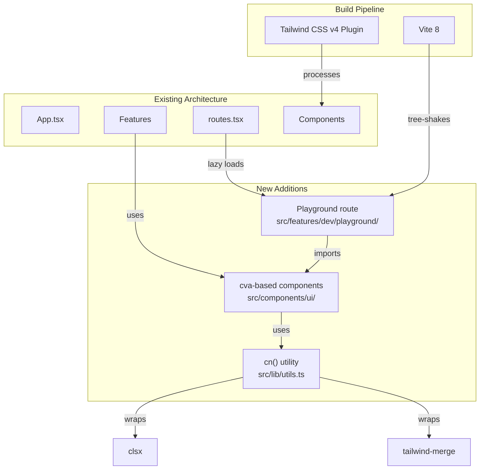
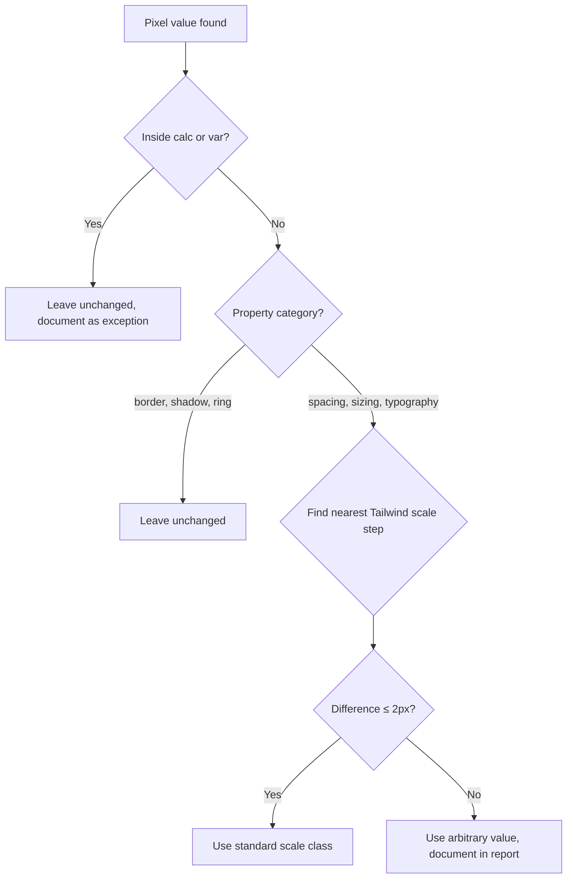

# Design Document: Frontend Cleanliness Refactor

## Overview

This design describes the architecture and implementation strategy for a comprehensive code cleanliness, responsiveness, and Tailwind consistency refactoring of the Flowlee frontend. The refactoring follows a strict sequential order: dead code removal → duplication consolidation → component library creation → Tailwind utilization + px→scale conversion → responsiveness fixes → naming/prop-ordering consistency.

The codebase currently uses Tailwind CSS v4 (via `@tailwindcss/vite` plugin), React 19, React Router, and Vite 8. The main styling issues observed are:

1. **Massive legacy CSS file** (`App.css`, ~2000 lines) with duplicated selectors, `!important` overrides, and single-letter class names (`.ax`, `.er`, `.bv`, `.gf`, etc.)
2. **Mixed styling approaches** — components use a combination of raw CSS classes, inline arrays joined with `.join(' ')`, and some Tailwind utilities
3. **No class composition utility** — conditional classes are built via array filter/join patterns (visible in `Button.tsx`, `LocaleSwitcher.tsx`)
4. **No variant system** — the existing `Button` component manually defines variant maps as `Record<Variant, string>` without cva
5. **Pixel values in Tailwind brackets** — e.g., `px-[28px]`, `py-[11px]`, `mr-[30px]` in Button.tsx

### Goals

- Zero visual regression at 375px, 768px, and 1280px viewports
- Maximal Tailwind utility coverage (eliminate legacy CSS where possible)
- Shared component library with cva-driven variants
- Developer playground for visual component verification
- Structured audit trail of all changes

### Non-Goals

- No new features or behavioral changes
- No new linters, formatters, or CI changes
- No Storybook or external documentation tools

---

## Architecture

The refactoring introduces three architectural additions to the existing codebase:



### Dependency Graph for Class Composition

```
Consumer Component
    └── imports shared component (e.g., <Button variant="primary" className="mt-4">)
         └── cva() resolves variant → base + variant classes
              └── cn() merges cva output + consumer className
                   └── clsx() normalizes conditional inputs
                        └── tailwind-merge resolves conflicts (consumer wins)
```

The data flow ensures that **consumer overrides always win** — if a consumer passes `className="mt-4"` and the component's base classes include `mt-2`, tailwind-merge resolves the conflict in favor of the consumer's `mt-4`.

---

## Components and Interfaces

### cn() Helper — `src/lib/utils.ts`

```typescript
import { type ClassValue, clsx } from 'clsx';
import { twMerge } from 'tailwind-merge';

/**
 * Compose Tailwind classes with conditional logic and conflict resolution.
 * Accepts any combination of strings, arrays, objects, undefined, null, false.
 * Passes through clsx for normalization, then tailwind-merge for deduplication.
 */
export function cn(...inputs: ClassValue[]): string {
  return twMerge(clsx(inputs));
}
```

**Design decisions:**
- Single named export (`cn`) — short, memorable, matches community convention (shadcn/ui)
- Variadic args rather than array — allows `cn('base', condition && 'extra', className)`
- clsx first (normalizes conditionals) → twMerge second (resolves conflicts)

### cva-based Component Pattern

Each shared component in `src/components/ui/` follows this structure:

```typescript
import { cva, type VariantProps } from 'class-variance-authority';
import { cn } from '../../lib/utils';

const buttonVariants = cva(
  // Base classes (always applied)
  'inline-flex items-center justify-center rounded-full font-semibold transition-all cursor-pointer border-none',
  {
    variants: {
      variant: {
        primary: 'bg-black text-white hover:bg-gray-800',
        secondary: 'bg-transparent border border-gray-200 text-black hover:bg-gray-50',
        ghost: 'bg-transparent text-gray-600 hover:bg-gray-100',
      },
      size: {
        default: 'px-7 py-2.5 text-sm',
        sm: 'px-4 py-1.5 text-xs',
        lg: 'px-9 py-3 text-base',
      },
    },
    defaultVariants: {
      variant: 'primary',
      size: 'default',
    },
  }
);

export interface ButtonProps
  extends React.ButtonHTMLAttributes<HTMLButtonElement>,
    VariantProps<typeof buttonVariants> {}

export function Button({ variant, size, className, ...props }: ButtonProps) {
  return (
    <button className={cn(buttonVariants({ variant, size }), className)} {...props} />
  );
}
```

**Component library inventory (initial candidates based on codebase audit):**

| Component | Current State | Instances Found |
|-----------|--------------|-----------------|
| Button | `src/components/ui/Button.tsx` — array join, manual variant map | 10+ across onboarding steps |
| FormField | `src/components/ui/FormField.tsx` — CSS class `input-group` | 5+ in account/org steps |
| Toggle | Inline in `CompanySettingsStep` — CSS class `.switch`/`.slider` | 3+ in settings step |
| Card | `.Step` CSS class pattern — box-shadow, rounded, centered | Every onboarding step |
| Badge/Tag | `.ruolo-tag` CSS class — pill shape with active state | RoleStep, JobStep |

### Playground Route — `src/features/dev/playground/Playground.tsx`

```typescript
import { Button } from '../../../components/ui/Button';
import { FormField } from '../../../components/ui/FormField';
import { LocaleSwitcher } from '../../../components/ui/LocaleSwitcher';

function ComponentSection({ name, children }: { name: string; children: React.ReactNode }) {
  return (
    <section className="mb-12">
      <h2 className="mb-4 text-xl font-bold text-gray-900">{name}</h2>
      <div className="flex flex-wrap gap-4">{children}</div>
    </section>
  );
}

export default function Playground() {
  return (
    <div className="min-h-screen bg-gray-50 p-8">
      <h1 className="mb-8 text-3xl font-bold">Component Playground</h1>
      <ComponentSection name="Button">
        {/* Render every variant × size combination with labels */}
      </ComponentSection>
      <ComponentSection name="FormField">
        {/* Render with/without error state */}
      </ComponentSection>
      <ComponentSection name="LocaleSwitcher">
        {/* Default rendering */}
      </ComponentSection>
    </div>
  );
}
```

### Route Registration with Production Exclusion

In `src/routes.tsx`, the playground route is conditionally registered:

```typescript
// Only include playground in development mode.
// import.meta.env.DEV is statically replaced by Vite at build time,
// making this branch dead code in production builds (tree-shaken).
if (import.meta.env.DEV) {
  routes.push({
    path: '/dev/playground',
    component: lazy(() => import('./features/dev/playground/Playground')),
    isPublic: true,
    label: 'Playground',
  });
}
```

**Why `import.meta.env.DEV`?** — Vite replaces this with `false` at production build time, allowing the bundler to statically analyze and eliminate the entire branch (including the dynamic import) from the production bundle. No runtime cost, no leaked code.

---

## Data Models

This refactoring does not introduce new data models or state. The changes are purely structural:

### File Layout Changes

```
src/
├── lib/
│   └── utils.ts                    # NEW: cn() helper
├── components/
│   └── ui/
│       ├── Button.tsx              # MODIFIED: cva + cn()
│       ├── FormField.tsx           # MODIFIED: cn() for class composition
│       ├── LocaleSwitcher.tsx      # MODIFIED: cn() for class composition
│       ├── Toggle.tsx              # NEW: extracted from CompanySettingsStep
│       ├── Card.tsx                # NEW: extracted from .Step CSS pattern
│       └── Badge.tsx               # NEW: extracted from .ruolo-tag CSS pattern
├── features/
│   └── dev/
│       └── playground/
│           └── Playground.tsx      # NEW: playground page
└── ...

docs/
└── audit/
    └── frontend-cleanliness/
        ├── README.md               # Index with completion status
        ├── dead-code.md
        ├── duplication.md
        ├── component-library.md
        ├── tailwind-utilization.md
        ├── sizing-conversion.md
        ├── responsiveness.md
        ├── naming-consistency.md
        ├── visual-neutrality.md
        └── screenshots/
            ├── onboarding-375px.png
            ├── onboarding-768px.png
            ├── onboarding-1280px.png
            ├── dashboard-375px.png
            ├── dashboard-768px.png
            └── dashboard-1280px.png
```

### Audit Report Structure

Each audit report follows this template:

```markdown
# {Area Name} Audit

## Summary
- Issues identified: N
- Issues resolved: N
- Items left unchanged: N

## Changes

### {File path}
- **What**: Description of change
- **Before**: `code snippet` (if >3 lines of logic changed)
- **After**: `code snippet`

## Exceptions
- {File/symbol}: {one-sentence justification}
```

### px-to-Tailwind Conversion Logic

The conversion follows this decision tree:



**Tailwind scale reference (spacing):**
- 1 = 0.25rem = 4px
- 2 = 0.5rem = 8px
- 3 = 0.75rem = 12px
- 3.5 = 0.875rem = 14px
- 4 = 1rem = 16px
- 5 = 1.25rem = 20px
- 6 = 1.5rem = 24px
- 7 = 1.75rem = 28px
- 8 = 2rem = 32px

Example: `px-[28px]` → nearest is `7` (28px) → exact match → `px-7`
Example: `py-[11px]` → nearest is `2.5` (10px) or `3` (12px) → 11px is 1px from 12px → within threshold → `py-3`
Example: `mr-[30px]` → nearest is `7.5` (30px) → exact match → `mr-7.5` (or `8` = 32px, diff = 2px, within threshold → `mr-8`)

---

## Correctness Properties

*A property is a characteristic or behavior that should hold true across all valid executions of a system — essentially, a formal statement about what the system should do. Properties serve as the bridge between human-readable specifications and machine-verifiable correctness guarantees.*

Based on the prework analysis, the testable pure-function logic in this feature is concentrated in two areas: the `cn()` class composition utility and the px→Tailwind scale conversion logic. The rest of the feature is manual refactoring verified by compilation and visual comparison.

### Property 1: cn() idempotent conflict resolution

*For any* set of valid Tailwind class strings with conflicting utilities (e.g., `"mt-2"` and `"mt-4"`), `cn()` SHALL return a string containing only the last-specified utility for each conflict group, with no duplicate utility prefixes.

**Validates: Requirements 4.2**

### Property 2: cn() pass-through for non-conflicting classes

*For any* set of non-conflicting Tailwind class strings, `cn()` SHALL return a string containing all input classes (order may differ), with the total count of unique utility classes equal to the sum of unique classes across all inputs.

**Validates: Requirements 4.2**

### Property 3: cn() handles falsy inputs gracefully

*For any* combination of inputs including `undefined`, `null`, `false`, empty strings, and valid class strings, `cn()` SHALL return a string containing only the valid class tokens, never the literal strings "undefined", "null", or "false".

**Validates: Requirements 4.2**

### Property 4: px-to-scale snap threshold correctness

*For any* pixel value where the nearest Tailwind scale step is within 2px (inclusive), the conversion function SHALL return the standard scale class rather than an arbitrary value bracket.

**Validates: Requirements 6.1, 6.2, 6.5**

### Property 5: px-to-scale arbitrary fallback

*For any* pixel value where no Tailwind scale step is within 2px, the conversion function SHALL return a Tailwind arbitrary value in bracket notation (e.g., `p-[14px]`), and that arbitrary value SHALL encode the original pixel value exactly.

**Validates: Requirements 6.1, 6.2, 6.6**

### Property 6: Typography conversion independence

*For any* pair of (font-size px, line-height px) values, the conversion function SHALL produce two independent Tailwind classes — one `text-*` class mapped from font-size and one `leading-*` class mapped from line-height — where each mapping uses the snap threshold independently.

**Validates: Requirements 6.3**

---

## Error Handling

This refactoring is primarily a code transformation activity. Error handling considerations:

### Build-Time Errors
- **TypeScript compilation failures**: After each change, run `tsc -b` to verify zero new errors. If errors appear, revert the change and investigate.
- **Tailwind class resolution**: If a converted class doesn't resolve, check for typos or missing Tailwind v4 theme values. Use arbitrary values as fallback.

### Runtime Errors
- **Playground route in production**: Guarded by `import.meta.env.DEV` — if somehow reached in production (e.g., direct URL navigation), React Router's catch-all `*` route renders the 404 page. No additional error handling needed.
- **cn() with invalid inputs**: clsx handles all falsy types gracefully (returns empty string). tailwind-merge is tolerant of non-Tailwind classes (passes them through unchanged). No runtime errors expected.
- **Missing cva variant**: class-variance-authority returns base classes when an unknown variant is passed, plus any `defaultVariants`. Components remain rendered, just with default styling.

### Rollback Strategy
- Each refactoring category is a discrete commit (or set of commits). If visual regression is detected at any category boundary, the entire category can be reverted via `git revert`.
- The sequential execution order ensures earlier phases don't depend on later phases — reverting "responsiveness" doesn't break "component library".

---

## Testing Strategy

### Testing Approach

This feature uses a **dual testing strategy**:

1. **Property-based tests** (via `fast-check`, already in devDependencies) for the pure utility functions (`cn()` and px-to-scale conversion logic)
2. **Example-based unit tests** (via `vitest`) for component rendering, playground route exclusion, and specific conversion edge cases

### Property-Based Tests

The property-based tests validate the `cn()` helper and the px-to-scale conversion function — the two pieces of pure logic introduced by this refactoring.

- Library: `fast-check` (already present in devDependencies)
- Test runner: `vitest` (already present)
- Minimum iterations: 100 per property
- Tag format: `Feature: frontend-cleanliness-refactor, Property N: {property text}`

**Test files:**
- `src/lib/utils.test.ts` — Properties 1–3 (cn() behavior)
- `src/lib/tailwind-scale.test.ts` — Properties 4–6 (px conversion)

### Unit Tests

| Area | Test File | What's Verified |
|------|-----------|-----------------|
| cn() edge cases | `src/lib/utils.test.ts` | Empty call, single arg, nested arrays |
| Button component | `src/components/ui/Button.test.tsx` | Renders with each variant, className override works |
| Playground exclusion | `src/features/dev/playground/Playground.test.ts` | Not in production route list |
| Production build | integration test (manual) | Playground chunk absent from `dist/` |

### Visual Verification (Manual)

Visual neutrality is verified manually at each phase boundary:
1. Capture baseline screenshots at 375px, 768px, 1280px
2. After each category of changes, compare against baseline
3. Any deviation at 1280px → revert and find alternative approach
4. Deviations at 375px/768px are acceptable only if they fix responsiveness issues

### Build Verification

After every change:
```bash
npm run build   # tsc -b && vite build — must exit 0
npm run test    # vitest --run — must pass
```
