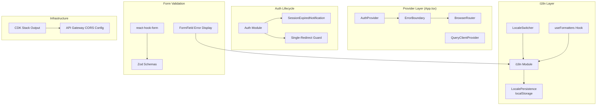

# Design Document: Integration Hardening & Localization

## Overview

This feature hardens the Flowlee frontend across five cross-cutting concerns that share integration touchpoints:

1. **Internationalization & Localization** — full i18n coverage with locale-aware formatting
2. **Auth Session Lifecycle** — clean logout, expiry handling, single-redirect guard
3. **Form Validation** — react-hook-form + zod with i18n-aware error messages
4. **Global Error Boundary** — crash recovery without blank screens
5. **CORS Coordination** — per-stage origin whitelisting

These concerns are treated as a single deliverable because they share dependencies: form validation errors use i18n keys, the error boundary must not intercept session-expired redirects, and CORS must be configured before any authenticated API call can succeed.

### Key Design Decisions

| Decision | Rationale |
|----------|-----------|
| Extend existing `src/lib/i18n.ts` rather than replace | Already wired into React tree; minimal disruption |
| `localStorage` for language persistence only (not tokens) | Tokens stay in-memory per architecture doc; language is non-sensitive |
| Single `useFormatters()` hook wrapping `Intl` APIs | Colocates all formatting, auto-reacts to locale changes |
| Class-based Error Boundary | React 19 still requires class component for `componentDidCatch` |
| RP-initiated logout via oidc-client-ts `signoutRedirect` | Already available in `UserManager`; compliant with Auth0 |
| Session-expired notification → 3s delay → redirect | Gives user awareness without blocking recovery |
| `@hookform/resolvers/zod` for schema binding | Official adapter; avoids manual integration boilerplate |
| CDK stack output for frontend domain | Enables automation of Auth0 URI registration |

---

## Architecture



### Provider Nesting Order

The component tree nesting in `App.tsx` will be:

```
AuthProvider
  └─ QueryClientProvider
       └─ BrowserRouter
            └─ ErrorBoundary          ← NEW: catches render errors below
                 └─ SessionExpiredNotification  ← NEW: toast layer
                      └─ AppRoutes
```

The Error Boundary sits **below** the router so that navigation still works for recovery, but **above** all route content so no page crash escapes.

---

## Components and Interfaces

### 1. i18n Module Enhancement (`src/lib/i18n.ts`)

```typescript
// Enhanced initialization
const STORAGE_KEY = 'flowlee-lang';
const SUPPORTED_LOCALES = ['en', 'it'] as const;
type SupportedLocale = typeof SUPPORTED_LOCALES[number];

function getInitialLocale(): SupportedLocale {
  try {
    const stored = localStorage.getItem(STORAGE_KEY);
    if (stored && SUPPORTED_LOCALES.includes(stored as SupportedLocale)) {
      return stored as SupportedLocale;
    }
    // Remove invalid entry if present
    if (stored !== null) {
      localStorage.removeItem(STORAGE_KEY);
    }
  } catch {
    // localStorage unavailable — use default
  }
  return 'en';
}

function persistLocale(locale: SupportedLocale): void {
  try {
    localStorage.setItem(STORAGE_KEY, locale);
  } catch {
    // Silently fail — app continues with in-memory locale
  }
}
```

### 2. LocaleSwitcher Component (`src/components/ui/LocaleSwitcher.tsx`)

```typescript
interface LocaleSwitcherProps {
  className?: string;
}

// Presents exactly two options: English, Italian
// On selection: calls i18n.changeLanguage() + persistLocale()
// Renders current language indicator (flag icon or abbreviation)
```

### 3. Formatting Hook (`src/lib/useFormatters.ts`)

```typescript
interface Formatters {
  formatDate(date: Date | string | number, options?: Intl.DateTimeFormatOptions): string;
  formatNumber(value: number, options?: Intl.NumberFormatOptions): string;
  formatCurrency(value: number, currency: string, options?: Intl.NumberFormatOptions): string;
}

function useFormatters(): Formatters;
```

The hook subscribes to `i18n.on('languageChanged')` and returns memoized formatter functions bound to the current locale. If the browser's `Intl` doesn't support the active locale, it falls back to 'en'.

### 4. Auth Session Enhancements (`src/features/auth/auth-provider.tsx`)

#### Logout Enhancement

```typescript
// Enhanced logout flow:
// 1. mgr.signoutRedirect({ post_logout_redirect_uri: window.location.origin })
// 2. On success: Auth0 redirects to origin, user lands unauthenticated
// 3. On network failure: clear tokens locally, queryClient.clear(), 
//    reset zustand stores, navigate to '/'
```

#### Session Expiry Handling

```typescript
interface SessionExpiredState {
  isExpired: boolean;
  returnPath: string | null;
}

// New behavior on refresh failure:
// 1. Set isExpired = true (triggers notification)
// 2. Capture current path + query string
// 3. After 3s timeout, redirect to Auth0 login with state = returnPath
// 4. Single-redirect guard: use a ref to prevent multiple concurrent redirects
```

#### Single-Redirect Guard

```typescript
// Module-level flag prevents multiple 401s from triggering concurrent redirects
let redirectInProgress = false;

function guardedRedirectToLogin(returnPath: string): void {
  if (redirectInProgress) return;
  redirectInProgress = true;
  // ... initiate redirect
  // Reset flag after redirect completes or fails
}
```

### 5. Session Expired Notification (`src/features/auth/SessionExpiredNotification.tsx`)

```typescript
// Renders a fixed-position toast/banner when session expires
// Shows: "Your session has expired. Redirecting to login..."
// Auto-dismisses after redirect (3 seconds)
// Does NOT use Error Boundary — this is expected behavior, not a crash
```

### 6. Global Error Boundary (`src/components/ErrorBoundary.tsx`)

```typescript
interface ErrorBoundaryState {
  hasError: boolean;
  error: Error | null;
}

class ErrorBoundary extends React.Component<
  { children: React.ReactNode },
  ErrorBoundaryState
> {
  // componentDidCatch: logs error + componentStack to console
  // render: if hasError, show fallback UI with reload button
  // fallback: centered, full-height, heading + description + button
}
```

### 7. Form Validation Layer

#### Shared Form Infrastructure (`src/lib/form-utils.ts`)

```typescript
import { zodResolver } from '@hookform/resolvers/zod';
import type { UseFormProps } from 'react-hook-form';
import type { ZodSchema } from 'zod';

// Helper to create form config with zod resolver and i18n error map
function createFormConfig<T extends ZodSchema>(
  schema: T,
  options?: Partial<UseFormProps>
): UseFormProps;
```

#### FormField Component (`src/components/ui/FormField.tsx`)

```typescript
interface FormFieldProps {
  name: string;
  label: string;       // i18n key
  error?: string;      // i18n key for error message
  children: ReactNode; // input element
}

// Renders label + input + conditional error message
// Error message uses useTranslation() to resolve i18n key
// Accessibility: aria-invalid, aria-describedby linking error to input
```

#### Validation Mode Configuration

```typescript
// react-hook-form configuration per requirement:
// - mode: 'onBlur' — validate on blur for initial feedback
// - reValidateMode: 'onChange' — after first submission with errors,
//   validate on every change until form is valid
// - resolver: zodResolver(schema)
```

### 8. CDK Stack Enhancement (`infra/lib/frontend-stack.ts`)

```typescript
// New output:
new cdk.CfnOutput(this, 'FrontendDomain', {
  value: props.domainName,
  description: 'Frontend domain for Auth0 redirect URI registration',
  exportName: `flowlee-${props.stage}-frontend-domain`,
});
```

### 9. CORS Coordination (Documentation/Checklist)

This is a backend API Gateway configuration concern. The frontend's role is:
- CDK outputs the domain per stage
- Deployment docs specify exactly which origin to whitelist
- No frontend code changes for CORS itself

---

## Data Models

### Language Persistence

```typescript
// localStorage schema
// Key: 'flowlee-lang'
// Value: 'en' | 'it'
// No versioning needed — single string value

const STORAGE_KEY = 'flowlee-lang';
type SupportedLocale = 'en' | 'it';
```

### Session Expired Event

```typescript
interface SessionExpiredEvent {
  returnPath: string;         // e.g., '/dashboard?tab=projects'
  timestamp: number;          // Date.now()
  reason: 'refresh_failed' | 'token_expired';
}
```

### Form Validation Error Shape

```typescript
// Standard react-hook-form FieldError
interface FieldError {
  type: string;          // e.g., 'too_small', 'invalid_type'
  message?: string;      // i18n key: e.g., 'validation.email_required'
}

// Zod error map integration
const zodErrorMap: ZodErrorMap = (issue, ctx) => {
  // Map zod issue codes to i18n keys
  // e.g., ZodIssueCode.too_small → 'validation.field_too_short'
  return { message: i18nKey };
};
```

### CORS Configuration Model (Backend Reference)

```typescript
// Per-stage configuration (lives in backend, documented here for coordination)
interface CorsStageConfig {
  stage: 'dev' | 'test' | 'preprod' | 'prod';
  allowedOrigin: string;  // e.g., 'https://dev.flowlee.com'
  allowMethods: string[]; // ['GET', 'POST', 'PUT', 'PATCH', 'DELETE', 'OPTIONS']
  allowHeaders: string[]; // ['Content-Type', 'Authorization']
  maxAge: 3600;
}
```

### Stage Domain Mapping

```typescript
// Used by CDK and deployment docs
const STAGE_DOMAINS: Record<string, string> = {
  dev: 'dev.flowlee.com',
  test: 'test.flowlee.com',
  preprod: 'preprod.flowlee.com',
  prod: 'app.flowlee.com',   // production uses root subdomain
};
```

---

## Correctness Properties

*A property is a characteristic or behavior that should hold true across all valid executions of a system — essentially, a formal statement about what the system should do. Properties serve as the bridge between human-readable specifications and machine-verifiable correctness guarantees.*

### Property 1: Language Persistence Round-Trip

*For any* supported locale ('en' or 'it') selected by the user, persisting it to localStorage and then reading it back via the initialization function SHALL produce the same locale value.

**Validates: Requirements 1.4, 2.1, 2.2**

### Property 2: Invalid Locale Rejection

*For any* string stored in localStorage that is NOT a member of the supported locales set ('en', 'it'), the initialization function SHALL discard the value, remove it from storage, and return 'en'.

**Validates: Requirements 1.5, 2.3**

### Property 3: Missing Translation Key Fallback

*For any* translation key that exists in the English locale file but not in the Italian locale file, resolving that key with Italian as the active locale SHALL return the English translation value (not the key itself or an empty string).

**Validates: Requirements 1.3**

### Property 4: localStorage Failure Does Not Crash

*For any* language selection operation, if localStorage throws on write, the i18n module SHALL still hold the selected locale in memory and SHALL not throw an unhandled exception.

**Validates: Requirements 2.4**

### Property 5: Date Formatting Locale Consistency

*For any* valid Date value and any supported locale, the `formatDate` function SHALL produce output identical to `Intl.DateTimeFormat` with that locale and `dateStyle: 'short'`.

**Validates: Requirements 3.1**

### Property 6: Number Formatting Decimal Separator

*For any* numeric value with a fractional part, formatting with 'it' locale SHALL use comma as the decimal separator, and formatting with 'en' locale SHALL use period as the decimal separator.

**Validates: Requirements 3.2**

### Property 7: Currency Formatting Includes Currency Identifier

*For any* numeric value and any valid ISO 4217 currency code, formatting with `Intl.NumberFormat` in currency style SHALL produce a string that contains the currency symbol or code.

**Validates: Requirements 3.3**

### Property 8: Route Path Preservation on Session Expiry

*For any* valid route path including query string parameters, when a session expiry triggers a redirect to login, the OIDC state parameter SHALL contain the full original path so it can be restored after re-authentication.

**Validates: Requirements 5.4, 5.5**

### Property 9: Single-Redirect Guard Under Concurrent 401s

*For any* number N (≥ 2) of simultaneous 401 responses triggering the redirect-to-login flow, the system SHALL execute exactly one redirect to the Auth0 login page.

**Validates: Requirements 5.7**

### Property 10: Zod Schema Rejects Invalid Input and Accepts Valid Input

*For any* input that violates a form's zod schema, calling `schema.safeParse(input)` SHALL return `{ success: false }` with at least one error, and *for any* input that satisfies the schema, `safeParse` SHALL return `{ success: true }`.

**Validates: Requirements 7.2, 7.3, 7.4**

### Property 11: Validation Error Messages Are Valid i18n Keys

*For any* validation error produced by the zod error map, the error message string SHALL be a valid key that exists in both the English and Italian translation files.

**Validates: Requirements 7.6**

---

## Error Handling

### Error Categories and Handling Strategy

| Category | Source | Handler | User Impact |
|----------|--------|---------|-------------|
| Render crash | Any component below ErrorBoundary | ErrorBoundary class | Fallback UI with reload button |
| Session expired | Auth module refresh failure | SessionExpiredNotification | Toast + 3s redirect to login |
| API 4xx/5xx | apiClient fetch | Calling component (via react-query error state) | Per-feature error display |
| Network failure | apiClient fetch | apiClient throws ApiError | Per-feature or global offline indicator |
| localStorage failure | i18n persistence | Silent catch, no user impact | None — operates in-memory |
| Missing env vars | App startup | `env.ts` throws | App fails to mount (developer error) |
| Auth0 redirect mismatch | Auth callback | callback.tsx error state | Error message + redirect to `/` |

### Error Boundary vs Session Expiry

These are explicitly **separate concerns**:

- **Error Boundary** catches unexpected JavaScript errors during React rendering. It wraps the component tree and shows a fallback UI.
- **Session Expiry** is an expected application state transition (token expired). It is handled by the auth module showing a notification and redirecting — this is NOT an error and should NOT trigger the Error Boundary.

The session-expired redirect happens via controlled state change (setting `isExpired = true`), not via thrown exceptions, so the Error Boundary will never intercept it.

### Logout Failure Resilience

If the network call to Auth0's logout endpoint fails:
1. All local tokens are cleared regardless
2. TanStack Query cache is cleared (`queryClient.clear()`)
3. Zustand stores are reset
4. User is navigated to `/` in an unauthenticated state
5. The failed revocation at Auth0 means the session may still be active server-side, but the user is locally signed out — they'd need to re-authenticate to get new tokens

---

## Testing Strategy

### Unit Tests (Example-Based)

Unit tests cover specific scenarios and integration points:

- **Error Boundary**: renders fallback when child throws; logs error to console; reload button triggers `window.location.reload()`
- **LocaleSwitcher**: renders two options; clicking triggers `i18n.changeLanguage`; reflects current language
- **SessionExpiredNotification**: appears when `isExpired` is true; disappears after redirect
- **Auth logout**: clears tokens, clears query cache, resets stores, navigates to `/`
- **Auth callback**: restores return path from OIDC state; defaults to `/dashboard` when no state
- **CDK stack output**: outputs `FrontendDomain` with correct stage domain
- **Single-redirect guard**: only one redirect occurs when multiple 401s arrive simultaneously

### Property-Based Tests

Property-based tests verify universal correctness across generated inputs. Library: **fast-check** (TypeScript PBT library).

Configuration:
- Minimum 100 iterations per property test
- Each test tagged with: **Feature: integration-hardening-localization, Property {N}: {title}**

Properties to implement:
1. Language persistence round-trip
2. Invalid locale rejection
3. Missing translation key fallback
4. localStorage failure does not crash
5. Date formatting locale consistency
6. Number formatting decimal separator
7. Currency formatting includes currency identifier
8. Route path preservation on session expiry
9. Single-redirect guard under concurrent 401s
10. Zod schema rejects invalid / accepts valid input
11. Validation error messages are valid i18n keys

### Integration Tests

- **CORS preflight**: verify OPTIONS request from correct origin returns expected headers (backend test)
- **Full auth flow**: login → callback → route restoration → session → logout → unauthenticated state
- **Auth0 URI mismatch**: verify error indication when redirect_uri doesn't match registration

### What Is NOT Property-Tested

| Area | Reason | Alternative |
|------|--------|-------------|
| Error Boundary rendering | React class component side-effects | Unit test with intentionally throwing child |
| Session expired notification timing | Involves setTimeout and DOM | Unit test with fake timers |
| CORS configuration | Infrastructure config, not logic | CDK assertion tests + integration test |
| CDK outputs | Infrastructure declaration | CDK `assertions` library snapshot tests |
| RP-initiated logout | Side-effect (HTTP call + redirect) | Mock-based unit test |
