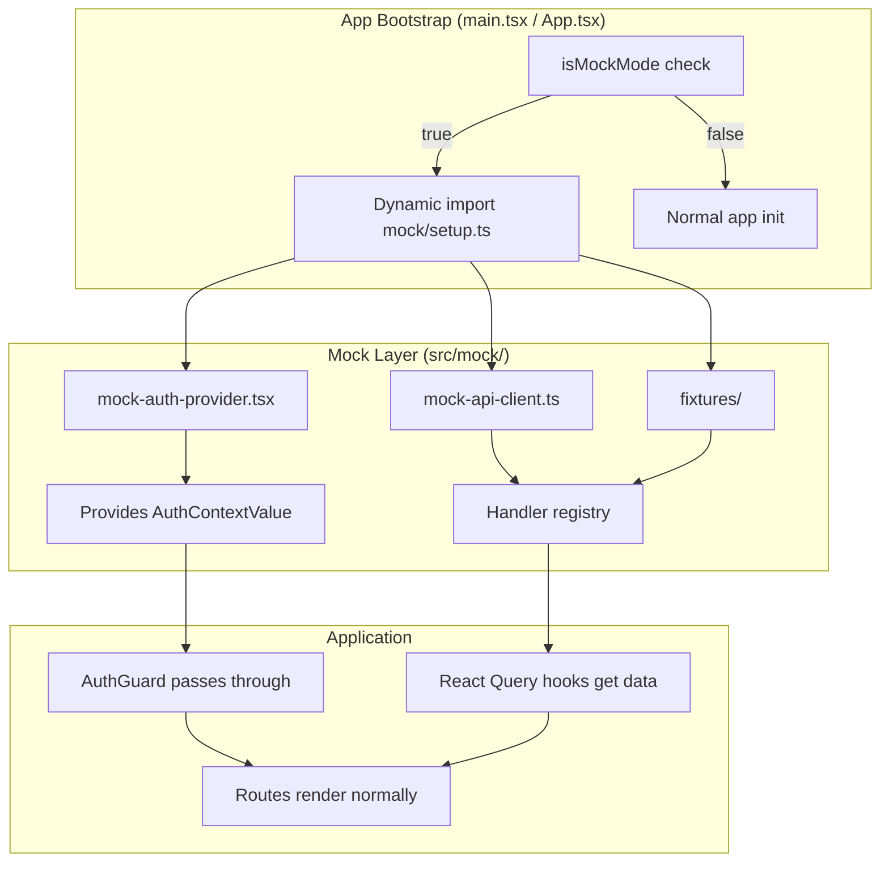

# Design Document: Mock Mode for Local Development

## Overview

This design introduces a mock layer that allows the Flowlee frontend to run independently of backend services and authentication providers. When `VITE_MOCK=true`, the app replaces its real `AuthProvider` and API client with lightweight mock implementations that return static fixture data. The mock code is conditionally loaded via dynamic imports, ensuring Vite tree-shakes it from production builds.

The design prioritizes:
- **Zero-config startup**: `VITE_MOCK=true` is the only required env var
- **Interface parity**: Mock implementations expose the exact same TypeScript interfaces as real ones
- **Production safety**: Dynamic imports and dead-code elimination guarantee mock code never ships

## Architecture



### Key Design Decisions

1. **Conditional AuthProvider at App level**: `App.tsx` renders either `MockAuthProvider` or the real `AuthProvider` based on `isMockMode()`. This is a single branch at the top of the component tree — all downstream components (AuthGuard, useAuth hook) work unchanged.

2. **Mock API via handler registry, not fetch interception**: Instead of patching `globalThis.fetch` (brittle, affects third-party libs), the mock API client replaces the internal `request` function behavior by registering handlers keyed by `METHOD:path`. This approach is explicit, type-safe, and easy to extend.

3. **Dynamic import for tree-shaking**: The mock setup module is loaded with `await import('./mock/setup')` inside an `if (isMockMode())` guard. Vite's static analysis sees the import is conditional on a compile-time constant (`import.meta.env.VITE_MOCK`) and eliminates the entire subtree from production.

4. **env.ts early-exit**: The `validateEnv()` function checks `VITE_MOCK` first. If mock mode is active, it returns dummy placeholder values for all three required vars, preventing startup crashes.

## Components and Interfaces

### 1. Mock Mode Detection — `src/mock/index.ts`

```typescript
export function isMockMode(): boolean {
  return import.meta.env.VITE_MOCK === 'true';
}
```

Single source of truth for the mock mode check. Used by `env.ts`, `App.tsx`, and the mock indicator component.

### 2. Mock Auth Provider — `src/mock/mock-auth-provider.tsx`

Implements the same `AuthContextValue` interface as the real provider:

```typescript
interface AuthContextValue {
  isAuthenticated: boolean;       // always true
  isLoading: boolean;             // always false
  isSessionExpired: boolean;      // always false
  user: OidcUser | null;          // mock user from fixtures
  getAccessToken(): string | null; // returns static "mock-access-token"
  login(returnTo?: string): void;  // no-op
  logout(): Promise<void>;         // no-op (resolves immediately)
  silentRefresh(): Promise<boolean>; // no-op (resolves true)
}
```

Renders via the same `AuthContext` so `useAuth()` works without changes. The mock user is imported from `fixtures/user.ts`.

### 3. Mock API Client — `src/mock/mock-api-client.ts`

A handler registry that intercepts `apiClient` calls:

```typescript
type MockHandler = (body?: unknown) => unknown;

interface HandlerRegistryEntry {
  method: string;
  pathPattern: string | RegExp;
  handler: MockHandler;
}

// Public API
export function registerMockHandler(method: string, path: string | RegExp, handler: MockHandler): void;
export function enableMockApi(): void;   // patches apiClient methods
export function disableMockApi(): void;  // restores original methods
```

**How it works**: `enableMockApi()` replaces each method on `apiClient` (`get`, `post`, `put`, `patch`, `delete`) with a function that:
1. Looks up a matching handler from the registry by `method + path`
2. If found: waits 50-100ms (random delay), then resolves with the handler's return value
3. If not found: rejects with a descriptive error (`No mock handler registered for GET /api/projects`)

### 4. Fixtures — `src/mock/fixtures/`

Individual files per domain, each exporting typed mock data:

| File | Exports | Used by |
|------|---------|---------|
| `user.ts` | `mockUser: OidcUser` | MockAuthProvider |
| `dashboard.ts` | `mockProjects`, `mockTasks`, `mockTeamMembers` | Mock API handlers |
| `onboarding.ts` | `mockOrgTypes`, `mockRoles` | Mock API handlers |

Fixtures use the same TypeScript interfaces as real API responses.

### 5. Mock Setup — `src/mock/setup.ts`

Orchestrates mock activation:

```typescript
import { registerMockHandler, enableMockApi } from './mock-api-client';
import { mockProjects, mockTasks, mockTeamMembers } from './fixtures/dashboard';
import { mockOrgTypes, mockRoles } from './fixtures/onboarding';

// Register handlers for known endpoints
registerMockHandler('GET', '/projects', () => mockProjects);
registerMockHandler('GET', '/tasks', () => mockTasks);
registerMockHandler('GET', '/team', () => mockTeamMembers);
registerMockHandler('GET', '/onboarding/org-types', () => mockOrgTypes);
registerMockHandler('GET', '/onboarding/roles', () => mockRoles);

// Activate mock interception
enableMockApi();
```

### 6. Mock Indicator — `src/mock/MockIndicator.tsx`

A small floating badge rendered only in mock mode:

```typescript
export function MockIndicator() {
  return (
    <div className="fixed bottom-4 left-4 z-50 rounded-full bg-amber-500 px-3 py-1 text-xs font-bold text-white shadow-lg">
      MOCK MODE
    </div>
  );
}
```

Rendered conditionally in `App.tsx` when `isMockMode()` is true.

### 7. Updated `env.ts`

```typescript
import { isMockMode } from './mock';

function validateEnv(): AppEnv {
  if (isMockMode()) {
    return {
      VITE_API_BASE_URL: 'http://mock.local',
      VITE_AUTH_AUTHORITY: 'http://mock.local/auth',
      VITE_AUTH_CLIENT_ID: 'mock-client-id',
    };
  }
  // ... existing validation logic unchanged
}
```

### 8. Updated `App.tsx`

```typescript
import { isMockMode } from './mock';
import { MockAuthProvider } from './mock/mock-auth-provider';
import { MockIndicator } from './mock/MockIndicator';

function App() {
  const AuthWrapper = isMockMode() ? MockAuthProvider : AuthProvider;

  return (
    <AuthWrapper>
      <QueryClientProvider client={queryClient}>
        <BrowserRouter>
          <ErrorBoundary>
            {isMockMode() && <MockIndicator />}
            <SessionExpiredNotification />
            <LocaleSwitcher className="fixed top-4 right-4 z-50" />
            <AppRoutes />
          </ErrorBoundary>
        </BrowserRouter>
      </QueryClientProvider>
    </AuthWrapper>
  );
}
```

Note: The `MockAuthProvider` and `MockIndicator` imports are static here but they are lightweight modules. The heavier mock setup (fixtures, handler registration) is dynamically imported in `main.tsx` before `App` renders. Alternatively, both can be lazy-loaded via dynamic imports inside the mock mode branch if further isolation is desired.

## Data Models

### OidcUser (existing interface — mock must match)

```typescript
interface OidcUser {
  sub: string;
  email: string;
  name: string;
}
```

### Mock Fixture Types

```typescript
// Dashboard entities (shape TBD by backend, using reasonable defaults)
interface Project {
  id: string;
  name: string;
  status: 'active' | 'archived';
  createdAt: string;
}

interface Task {
  id: string;
  title: string;
  projectId: string;
  assigneeId: string;
  status: 'todo' | 'in-progress' | 'done';
  dueDate: string | null;
}

interface TeamMember {
  id: string;
  name: string;
  email: string;
  role: string;
  avatarUrl: string | null;
}

// Onboarding entities
interface OrgType {
  id: string;
  label: string;
  description: string;
}

interface Role {
  id: string;
  label: string;
  description: string;
}
```

### Handler Registry Internal Model

```typescript
interface MockHandlerEntry {
  method: string;
  pathPattern: string | RegExp;
  handler: (body?: unknown) => unknown;
}
```

## Error Handling

| Scenario | Behavior |
|----------|----------|
| `isMockMode()` is true but mock setup fails to import | App crashes with clear console error indicating mock setup failure |
| API call with no registered handler | Returns rejected Promise with descriptive message: `"No mock handler for METHOD /path"` |
| Mock handler throws | Error propagates to React Query / caller as it would with a real network error |
| Invalid `VITE_MOCK` value (e.g., `"yes"`) | Treated as inactive — only `"true"` activates mock mode |

## Testing Strategy

### PBT Assessment

This feature is **not suitable for property-based testing**:
- It consists of conditional wiring (if mock → use mock provider), UI rendering (badge), and configuration validation (env.ts early-exit)
- There are no pure functions with meaningful input variation — the mock layer either activates or it doesn't
- The handler registry lookup is simple string matching, not a parser or serializer
- The primary risks are integration issues (wrong interface shape, missing handler) best caught by example-based tests

### Recommended Testing Approach

**Unit tests** (Vitest + Testing Library):
1. `isMockMode()` returns `true` when `VITE_MOCK=true`, `false` otherwise
2. `validateEnv()` skips validation in mock mode, throws when vars are missing in normal mode
3. `MockAuthProvider` exposes correct `AuthContextValue` (isAuthenticated: true, user present, methods are no-ops)
4. Mock API handler registry: returns registered handler's data, rejects for unregistered paths
5. `MockIndicator` renders only in mock mode

**Integration tests** (Vitest + Testing Library):
1. Full App renders in mock mode without errors (mocked env)
2. Protected routes (`/dashboard`) are accessible in mock mode without auth redirect
3. Components can call `apiClient.get()` and receive mock data in mock mode

**Manual verification**:
1. `vite build` produces no mock-related chunks (check dist output)
2. Running with `VITE_MOCK=true` shows the indicator badge and all routes work
