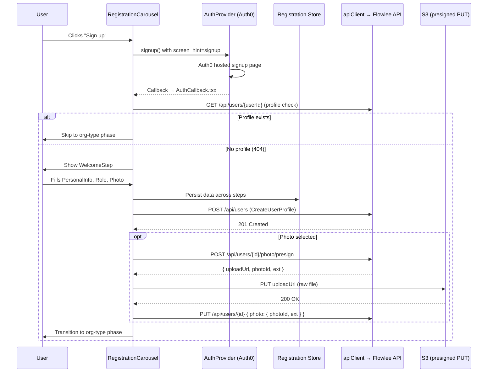

# Design Document: Registration Backend Integration

## Overview

This design connects the existing frontend registration wizard (`RegistrationCarousel`) to real backend services: Auth0 for identity creation, the Flowlee API for `UserProfile` persistence, and S3 (via presigned URLs) for photo upload. The carousel is restructured to remove steps now handled by Auth0 (AccountStep, SendingCodeStep, VerifyCodeStep), and the remaining steps are wired to API calls with proper error handling, loading states, and state persistence.

The integration follows the existing architectural patterns: `apiClient` for HTTP calls, TanStack Query mutations for async operations, Zustand for client state, and Zod for validation.

## Architecture



## Components and Interfaces

### 1. AuthProvider Extension

Add a `signup(returnTo?: string)` method to the existing `AuthContextValue` interface. This method calls `mgr.signinRedirect` with `extraQueryParams: { screen_hint: 'signup' }` merged with the existing audience param.

```typescript
// Addition to AuthContextValue
signup(returnTo?: string): void;

// Implementation (inside AuthProvider)
const signup = useCallback(
  (returnTo?: string) => {
    if (!mgr) return;
    const state = returnTo ?? '/onboarding';
    mgr.signinRedirect({
      state,
      extraQueryParams: {
        ...(audience ? { audience } : {}),
        screen_hint: 'signup',
      },
    });
  },
  [mgr],
);
```

### 2. AuthCallback Enhancement

Modify `AuthCallback.tsx` to detect "new signup" vs "existing user" by calling `GET /api/users/{userId}` after processing the OIDC callback. If 404, navigate to `/onboarding` (registration wizard). If 200, navigate to the state return path or `/dashboard`.

The `AuthProvider.establishSession()` is called to propagate the token into the auth context before the redirect.

### 3. Registration API Module

New file: `src/features/onboarding/api/registration-api.ts`

```typescript
import { apiClient } from '../../../lib/api-client';

// Types matching openapi.yml schemas
export interface CreateUserProfileRequest {
  userId: string;
  email: string;
  name?: string;
  surname?: string;
  gender?: 'male' | 'female' | 'other';
  birthDate?: string; // YYYY-MM-DD
  jobTitle?: string;
}

export interface UserProfile {
  userId: string;
  email: string;
  name?: string;
  surname?: string;
  gender?: 'male' | 'female' | 'other';
  birthDate?: string;
  jobTitle?: string;
  photo?: PhotoReference;
  createdAt: string;
  updatedAt: string;
}

export interface PhotoReference {
  photoId: string;
  ext: 'jpg' | 'png' | 'webp' | 'gif';
}

export interface PresignRequest {
  contentType: 'image/jpeg' | 'image/png' | 'image/webp' | 'image/gif';
  sizeBytes: number;
}

export interface PresignResponse {
  photoId: string;
  key: string;
  uploadUrl: string;
  contentType: string;
  sizeBytes: number;
  expiresIn: number;
}

export interface UpdateUserProfileRequest {
  email?: string;
  name?: string;
  surname?: string;
  gender?: 'male' | 'female' | 'other';
  birthDate?: string;
  jobTitle?: string;
  photo?: PhotoReference | null;
}

// API functions
export function getUserProfile(userId: string): Promise<UserProfile> {
  return apiClient.get<UserProfile>(`/api/users/${userId}`);
}

export function createUserProfile(data: CreateUserProfileRequest): Promise<UserProfile> {
  return apiClient.post<UserProfile>('/api/users', data);
}

export function presignPhotoUpload(userId: string, data: PresignRequest): Promise<PresignResponse> {
  return apiClient.post<PresignResponse>(`/api/users/${userId}/photo/presign`, data);
}

export function updateUserProfile(userId: string, data: UpdateUserProfileRequest): Promise<UserProfile> {
  return apiClient.put<UserProfile>(`/api/users/${userId}`, data);
}

export async function uploadToS3(uploadUrl: string, file: File, contentType: string): Promise<void> {
  const response = await fetch(uploadUrl, {
    method: 'PUT',
    headers: { 'Content-Type': contentType },
    body: file,
  });
  if (!response.ok) {
    throw new Error(`S3 upload failed with status ${response.status}`);
  }
}
```

### 4. Registration Store

New file: `src/features/onboarding/useRegistrationStore.ts`

A dedicated Zustand store for registration-specific data. Separate from `useOnboardingStore` (which handles phase/step navigation) to keep concerns isolated.

```typescript
import { create } from 'zustand';

interface RegistrationData {
  name: string;
  surname: string;
  gender: 'male' | 'female' | 'other' | '';
  birthDate: string;
  jobTitle: string;
  selectedPhotoFile: File | null;
}

interface RegistrationStore extends RegistrationData {
  setField: <K extends keyof RegistrationData>(key: K, value: RegistrationData[K]) => void;
  setPhoto: (file: File | null) => void;
  reset: () => void;
}
```

This store is **not** persisted to sessionStorage because the data is transient (only needed during the wizard flow). If the session is lost, the user re-enters data from the WelcomeStep.

### 5. Photo Upload Orchestration Hook

New file: `src/features/onboarding/hooks/useProfileCreation.ts`

A custom hook wrapping TanStack Query mutations for the multi-step profile creation flow:

```typescript
export function useProfileCreation() {
  // Step 1: Create UserProfile
  const createProfileMutation = useMutation({ ... });
  
  // Step 2: Presign photo upload
  const presignMutation = useMutation({ ... });
  
  // Step 3: Upload to S3
  const uploadMutation = useMutation({ ... });
  
  // Step 4: Update profile with PhotoReference
  const updateProfileMutation = useMutation({ ... });

  // Orchestrator function
  async function submitRegistration(params: {
    userId: string;
    email: string;
    profileData: RegistrationData;
  }): Promise<void> { ... }

  return {
    submitRegistration,
    isSubmitting: /* any mutation loading */,
    error: /* first error from any mutation */,
    reset: /* reset all mutation states */,
    currentStep: /* which sub-step is in progress */,
  };
}
```

### 6. Restructured Carousel

The `RegistrationCarousel` is refactored:
- Remove `AccountStep`, `SendingCodeStep`, `VerifyCodeStep` from the render
- New step order post-auth: index 0 = WelcomeStep, 1 = PersonalInfoStep, 2 = RoleStep, 3 = PhotoUploadStep
- The `AuthChoiceStep` is no longer part of the carousel — it's rendered separately before auth, or handled as a pre-auth landing within `OnboardingWizard`
- `TOTAL_STEPS` changes from 8 to 4

### 7. Profile Existence Guard

A hook or utility that runs on app load (or after AuthCallback) to check if a UserProfile already exists:

```typescript
export function useProfileCheck() {
  const { user, isAuthenticated } = useAuth();
  
  return useQuery({
    queryKey: ['userProfile', user?.sub],
    queryFn: () => getUserProfile(user!.sub),
    enabled: isAuthenticated && !!user?.sub,
    retry: false, // 404 is expected for new users
  });
}
```

The `OnboardingWizard` uses this to decide:
- If query returns data → skip registration, go to org-type or dashboard
- If query returns 404 error → show registration wizard
- If query is loading → show loading state

## Data Models

### Client-Side State

```typescript
// Registration store (Zustand, in-memory only)
interface RegistrationData {
  name: string;          // Required, from PersonalInfoStep
  surname: string;       // Required, from PersonalInfoStep
  gender: 'male' | 'female' | 'other' | '';  // Required, from PersonalInfoStep
  birthDate: string;     // Required, YYYY-MM-DD, from PersonalInfoStep
  jobTitle: string;      // Optional, from RoleStep
  selectedPhotoFile: File | null;  // Optional, from PhotoUploadStep
}
```

### API Request/Response Types

Derived directly from `openapi.yml` schemas:

| Endpoint | Request Type | Response Type |
|----------|-------------|---------------|
| `POST /api/users` | `CreateUserProfileRequest` | `UserProfile` (201) |
| `GET /api/users/{userId}` | — | `UserProfile` (200) or 404 |
| `POST /api/users/{userId}/photo/presign` | `PresignRequest` | `PresignResponse` (200) |
| `PUT uploadUrl` (S3) | raw `File` body | 200 (no body) |
| `PUT /api/users/{userId}` | `UpdateUserProfileRequest` | `UserProfile` (200) |

### Validation Schema (Zod)

Extend `src/features/onboarding/schemas.ts` — the existing `PersonalInfoSchema` already validates name, surname, gender, birthDate. Add photo validation:

```typescript
export const PhotoFileSchema = z.object({
  type: z.enum(['image/jpeg', 'image/png', 'image/webp', 'image/gif']),
  size: z.number().max(10_485_760, 'validation.file_too_large'),
});
```

## Error Handling

### Error Mapping Strategy

The existing `apiClient` throws structured `ApiError` with `{ status, message, url, method }`. The registration flow maps these to user-facing messages:

| Error Condition | ApiError.status | User Message |
|----------------|----------------|--------------|
| Network error | `null` | "Connection error. Please check your internet and try again." |
| Validation error | 400 | Display `ApiError.message` (from ErrorEnvelope) |
| Authorization error | 403 | "Authorization error. Please sign in again." |
| Server error | 500 | "Something went wrong. Please try again." |
| S3 upload failure | Non-2xx from S3 | "Photo upload failed. Please try again." |

### Retry Behavior

- Network errors and 500s: show "Try again" button that re-invokes the failed mutation
- 403 errors: show "Sign in again" link that calls `login()`
- 400 errors: show the validation message, let user correct input

### Loading States

Each mutation step exposes its loading state. The UI shows:
- A spinner overlay on the PhotoUploadStep card during submission
- Disabled "Continue" / "Complete" buttons while any mutation is in progress
- Progress text indicating current operation: "Creating profile…", "Uploading photo…", "Finishing up…"

## Testing Strategy

### Why Property-Based Testing Does Not Apply

This feature is an integration layer connecting UI components to external services (Auth0, REST API, S3). The behavior involves:
- Side effects (API calls, redirects, file uploads)
- UI state transitions driven by external responses
- Error display based on HTTP status codes

There are no pure data transformations, parsers, or algorithms with a wide input space that would benefit from random input generation. Universal properties like "for all inputs X, P(X) holds" don't meaningfully apply here.

### Unit Tests

- **Registration API functions**: Mock `apiClient` and verify correct paths, payloads, and types
- **Registration Store**: Test state transitions (setField, setPhoto, reset)
- **useProfileCreation hook**: Mock API functions, test orchestration sequence (create → presign → upload → update), error handling at each step
- **Photo validation**: Test boundary conditions (exact 10MB, invalid types, valid types)
- **AuthCallback routing**: Mock API response, test navigation to `/onboarding` on 404 vs `/dashboard` on 200

### Integration Tests

- **Full wizard flow** (with mocked APIs): Render RegistrationCarousel, fill fields, submit, verify API calls in correct order
- **Error recovery**: Simulate 500 on createProfile, verify retry button appears and works
- **Profile existence guard**: Verify skip-to-dashboard when profile exists
- **Photo upload flow**: Mock presign + S3, verify full chain executes

### Mock Handlers

Register mock handlers in `src/mock/setup.ts` for local development:
- `POST /api/users` → returns mock UserProfile
- `GET /api/users/:userId` → returns 404 initially (or 200 with stored profile)
- `POST /api/users/:userId/photo/presign` → returns mock presign response with a fake upload URL
- `PUT` to fake S3 URL → returns 200
- `PUT /api/users/:userId` → returns updated UserProfile
