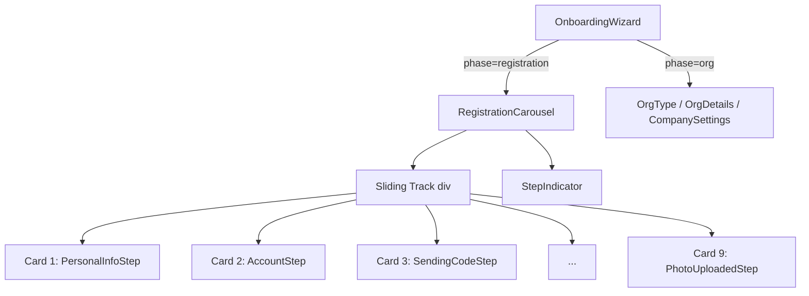

# Design Document: Registration Carousel

## Overview

This design refactors the onboarding registration flow (steps 1–9) from a page-switching wizard into a horizontal carousel rendered on a single page. The carousel centers one card at a time, shows faint shadows of adjacent cards, and slides left on step completion. The organizational flow (steps 10–12) remains outside the carousel as full-page components.

The implementation uses CSS transforms for sliding, CSS transitions for animation, and a new `RegistrationCarousel` React component that owns the active-step index. No external animation or carousel libraries are added — the approach relies on `translateX` and the `transition` CSS property.

## Architecture



**State flow:**
1. `OnboardingWizard` owns a `phase` state: `'registration' | 'org-type' | 'org-details' | 'company-settings' | 'done'`.
2. During `'registration'` phase, it renders `<RegistrationCarousel onComplete={() => setPhase('org-type')} />`.
3. `RegistrationCarousel` owns `activeIndex` (0–8). Each step calls `advance()` which increments `activeIndex`. When `activeIndex` reaches 8 and the user completes that step, `onComplete` fires.
4. During org phases, `OnboardingWizard` renders the corresponding full-page component (unchanged from current behavior).

## Components and Interfaces

### RegistrationCarousel

```tsx
interface RegistrationCarouselProps {
  onComplete: () => void
}
```

Responsibilities:
- Renders a viewport container with `overflow: hidden`.
- Contains a track `div` that holds all 9 cards side-by-side.
- Applies `transform: translateX(-(activeIndex * cardWidthWithGap)px)` on the track with a CSS transition.
- Passes `onNext={advance}` to each step component.
- Renders `<StepIndicator total={9} current={activeIndex} />` below the viewport.

### StepIndicator

```tsx
interface StepIndicatorProps {
  total: number
  current: number
}
```

Renders a row of dots. The dot at index `current` has a distinct color/size; others are muted.

### Step Component Adaptation

Each registration step component currently renders a root `<div className="Step">`. Inside the carousel:
- The root wrapper changes from `.Step` to a new `.carousel-card` class (or the existing `.Step` is left in place and the carousel overrides its sizing via a wrapper).
- The simpler approach: wrap each step component in a `<div className="carousel-card">` inside the carousel track, and keep step internals unchanged. The `.carousel-card` class enforces the fixed height and width.

**Chosen approach:** Keep existing step components untouched. The carousel wraps each in a `<div className="carousel-card">` that sets the fixed height and width. The inner `.Step` class styles flex-column layout and content within that fixed box.

### OnboardingWizard refactored interface

```tsx
type Phase = 'registration' | 'org-type' | 'org-details' | 'company-settings' | 'done'
```

Replaces the current `Step` type for the wizard-level state. The individual step progression within registration is delegated to `RegistrationCarousel`.

## Data Models

### Carousel Layout Constants

```tsx
const CAROUSEL_CONFIG = {
  cardWidth: 450,        // px – matches existing .Step max-width
  cardHeight: 640,       // px – fixed uniform height
  cardGap: 24,           // px – gap between cards
  adjacentScale: 0.92,   // scale of prev/next cards
  adjacentOpacity: 0.4,  // opacity of prev/next cards
  transitionDuration: 400, // ms
}
```

### Registration Steps Array

```tsx
const REGISTRATION_STEPS = [
  'personal-info',
  'account',
  'sending-code',
  'verify-code',
  'welcome',
  'role',
  'job',
  'photo-upload',
  'photo-uploaded',
] as const
```

This array provides the ordered list of 9 steps for the carousel to render.

## Error Handling

- **Overflow content**: If a step's content exceeds the fixed card height, the `.carousel-card` applies `overflow-y: auto` so the card becomes scrollable internally without breaking the layout.
- **Fast clicking**: The `advance` function is guarded with a `transitioning` ref. During the CSS transition duration, repeated calls are ignored.
- **Edge navigation**: `advance()` is a no-op when `activeIndex === 8` (handled by calling `onComplete` instead).
- **State preservation**: Each step component is always mounted (part of the track), so react-hook-form state persists. No lazy loading or unmounting.

## Testing Strategy

This feature is primarily a UI layout and animation concern. The core logic is:
1. Index management (advance, bounds checking)
2. CSS transform calculation
3. Correct rendering of dots

**Unit tests** (vitest + @testing-library/react):
- `RegistrationCarousel` renders all 9 step cards
- Advancing the carousel updates the transform style
- `StepIndicator` renders the correct number of dots and highlights the active one
- Advancing past step 9 calls `onComplete`
- Adjacent card shadows appear/disappear at boundaries (first/last step)

**Manual/visual tests**:
- Animation smoothness
- Responsive behavior on mobile viewports
- Overflow scrolling within tall-content cards

Property-based testing is **not applicable** for this feature. The carousel is a UI rendering concern with no pure-function logic that varies meaningfully across a wide input space. The index management is trivially bounded (0–8) and CSS transforms are deterministic given an index. Standard unit tests with specific examples provide better coverage for this type of component.
