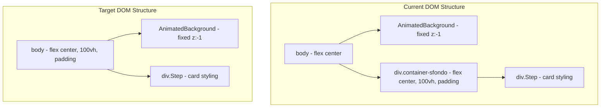

# Design Document: Remove Container Sfondo

## Overview

This design describes how to remove the `.container-sfondo` wrapper div from all 11 onboarding step components and relocate its layout responsibilities (flexbox centering, viewport sizing, padding) to the existing `body` styles and the `.Step` card class. The goal is a zero-visual-change refactoring that reduces DOM nesting and eliminates orphaned CSS.

### Key Insight

The `body` element already declares `display: flex; justify-content: center; align-items: center; min-height: 100vh`. The `.container-sfondo` div duplicates these same properties plus adds `width: 100%; padding: 20px`. Since `.Step` already has `margin: 20px`, the padding from `.container-sfondo` is functionally equivalent to the existing margin on `.Step`. The wrapper is therefore entirely redundant.

### Scope

- 10 step components that use `<div className="container-sfondo">` (CompanySettingsStep already uses inline styles and has no `.container-sfondo` wrapper)
- All CSS rules in `App.css` referencing `.container-sfondo`
- 2 test files that validate `.container-sfondo` CSS behavior
- The `wide-mode` selector that currently depends on the `.container-sfondo` ancestor

## Architecture



The refactoring collapses one layer of DOM nesting. Each step component currently returns:

```tsx
<div className="container-sfondo">
  <div className="Step">...</div>
</div>
```

After the change, each step component returns:

```tsx
<div className="Step">...</div>
```

## Components and Interfaces

### Affected Step Components (10 total)

All components follow the same pattern — the `<div className="container-sfondo">` wrapper is removed and the `<div className="Step ...">` becomes the root element:

| Component | Current Root | Target Root | Notes |
|-----------|-------------|-------------|-------|
| PersonalInfoStep | `div.container-sfondo` | `div.Step` | Standard pattern |
| AccountStep | `div.container-sfondo` | `div.Step` | Standard pattern |
| SendingCodeStep | `div.container-sfondo` | `div.Step` | Standard pattern |
| VerifyCodeStep | `div.container-sfondo` | `div.Step` | Standard pattern |
| WelcomeStep | `div.container-sfondo` | `div.Step` | Standard pattern |
| RoleStep | `div.container-sfondo` | `div.Step.step-header-layout` | Standard pattern |
| JobStep | `div.container-sfondo` | `div.Step.step-header-layout` | Standard pattern |
| PhotoUploadStep | `div.container-sfondo` | `div.Step.step-header-layout` | Standard pattern |
| OrgTypeStep | `div.container-sfondo` | `div.Step.step-header-layout.step10-layout` | Standard pattern |
| OrgDetailsStep | `div.container-sfondo` | `div.Step.step-header-layout.step10-layout` | Uses `wide-mode` behavior |

**CompanySettingsStep** is excluded — it uses a fixed fullscreen inline-style modal and does not use `.container-sfondo`.

### CSS Changes

#### Rules to delete entirely

1. `.container-sfondo { ... }` (line ~136 — duplicate at line ~1339)
2. `.container-sfondo.schermata-con-sfondo { ... }` (line ~1421)
3. `.container-sfondo.schermata-con-sfondo .Step { ... }` (lines ~1432 and ~1443)
4. `body .container-sfondo .Step.wide-mode { ... }` (line ~476)
5. Media query rule `.step10-layout, .container-sfondo { ... }` — remove `.container-sfondo` from the selector list
6. Media query rule `.container-sfondo, .Step, .step10-layout { ... }` — remove `.container-sfondo` from the selector list

#### Rules to add/modify

1. **body** — already has the needed flex centering properties; add `padding: 20px` to replace what `.container-sfondo` provided (or rely on `.Step`'s existing `margin: 20px`).

2. **`.Step.wide-mode`** — new direct selector replacing `body .container-sfondo .Step.wide-mode`:
   ```css
   .Step.wide-mode {
     min-height: 0 !important;
     height: auto !important;
     padding-bottom: 120px !important;
     align-self: flex-start !important;
   }
   ```

3. **Media query at max-width: 600px** — the existing responsive rules for `.Step` already provide `padding: 20px; margin: 10px; min-height: auto;` which is correct.

### Decision: `padding: 20px` location

The `.container-sfondo` provided `padding: 20px` to prevent the card touching viewport edges. Two options:

- **Option A**: Add `padding: 20px` to `body`. Simple but affects all pages.
- **Option B**: Rely on `.Step`'s existing `margin: 20px` which provides equivalent spacing.

**Decision**: Option B. The `.Step` class already has `margin: 20px`, which creates the same 20px gap between the card and viewport edges. No additional padding is needed on `body`. The body's `min-height: 100vh` combined with flex centering already handles viewport sizing.

## Data Models

No data model changes. This is a purely presentational refactoring with no state, API, or storage changes.

## Error Handling

No runtime error handling is applicable. Potential risks and mitigations:

| Risk | Mitigation |
|------|------------|
| Step card touches viewport edges on narrow screens | Verified: `.Step` has `margin: 20px`; media query at 600px provides `margin: 10px` |
| Wide-mode steps lose flex-start alignment | New `.Step.wide-mode` selector directly applies `align-self: flex-start` |
| AnimatedBackground becomes obscured | AnimatedBackground is `position: fixed` with `z-index: -1` — independent of DOM ancestors |
| Schermata-con-sfondo overflow: hidden is lost | Investigate which step uses it. If OrgDetailsStep needs `overflow: hidden`, add it to `.step10-layout` directly |

## Testing Strategy

### Why Property-Based Testing Does Not Apply

This feature is a **CSS/DOM refactoring** — removing a wrapper div and relocating CSS rules. There are no pure functions, parsers, serializers, or algorithms with varied input behavior. The changes are structural and visual:

- Removing a `<div>` from JSX templates
- Deleting/modifying CSS selectors
- Retargeting CSS rules to different selectors

Property-based testing cannot meaningfully validate "the card is still centered" or "the visual output is identical" — those are rendering assertions best handled by visual regression tests and example-based DOM assertions.

### Recommended Testing Approach

1. **Visual Regression Tests** (manual or automated screenshot comparison):
   - Compare screenshots of each onboarding step before and after the change at viewport widths 375px, 768px, and 1440px
   - Verify card centering, spacing, and background visibility

2. **Example-Based Unit Tests** (Vitest + Testing Library):
   - Each step component renders its `.Step` element as the root (no `.container-sfondo` wrapper)
   - The rendered DOM does not contain any element with class `container-sfondo`
   - Wide-mode steps correctly apply the `wide-mode` class

3. **CSS Validation**:
   - Grep-based assertion: `App.css` contains zero occurrences of the string `container-sfondo`
   - This replaces the existing `container-sfondo-background.test.tsx` and `container-sfondo-preservation.test.tsx`

4. **Smoke Test**:
   - Run the dev server and navigate through all 11 onboarding steps to confirm no visual breakage
   - Verify AnimatedBackground remains visible behind all step cards

### Test Files to Delete

- `src/features/onboarding/container-sfondo-background.test.tsx` — tests CSS rules that will no longer exist
- `src/features/onboarding/container-sfondo-preservation.test.tsx` — tests selectors that will no longer exist

### New Test (optional)

A single integration test confirming no step component renders a `.container-sfondo` element:

```typescript
import { render } from '@testing-library/react'
// render each step and assert:
expect(container.querySelector('.container-sfondo')).toBeNull()
```
