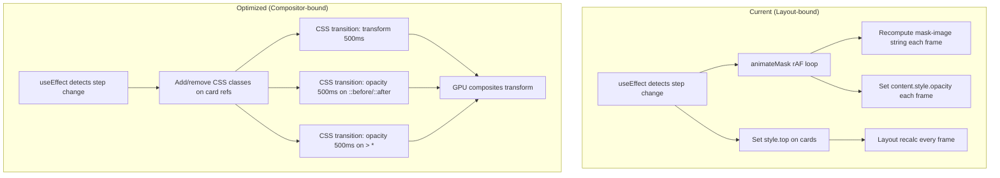

# Design Document: Vertical Carousel Performance Optimization

## Overview

This design details the migration of the `VerticalCarousel` component's transition animations from layout-triggering properties (`top`, per-frame `mask-image` strings, per-frame `opacity` manipulation) to compositor-friendly properties (`transform: translateY`, CSS `opacity` transitions on pseudo-elements and content). The visual behavior remains identical; only the rendering pipeline changes.

The key insight: the browser compositor can animate `transform` and `opacity` without triggering layout or paint. By expressing all motion through these two properties, we guarantee 60fps transitions on mid-range devices.

## Architecture

The optimization is purely a rendering-layer refactoring. No component API, data flow, or state management changes are required.



### Strategy Summary

| Concern | Current | Optimized |
|---------|---------|-----------|
| Card position | `style.top` (layout) | `transform: translateY()` (composite) |
| Mask fade | JS rAF → `mask-image` string (paint) | `::before`/`::after` pseudo-elements with `opacity` transition (composite) |
| Content opacity | JS rAF → `content.style.opacity` (paint) | CSS class toggle → `opacity` transition on `> *` (composite) |
| Layer promotion | None | `will-change: transform` on visible cards |

## Components and Interfaces

### File: `VerticalCarousel.css`

**New declarations added to `.vertical-carousel-card`:**
- `will-change: transform` — promotes visible cards to compositor layers
- `position: relative` — ensures pseudo-elements are contained (already effectively true since `position: absolute` on the card, but explicit for pseudo-element anchoring)

**New pseudo-elements on `.vertical-carousel-card`:**

```css
.vertical-carousel-card::before,
.vertical-carousel-card::after {
  content: '';
  position: absolute;
  inset: 0;
  pointer-events: none;
  opacity: 0;
  transition: opacity 500ms cubic-bezier(0.4, 0, 0.2, 1);
  z-index: 10;
  border-radius: inherit;
}

.vertical-carousel-card::before {
  background: linear-gradient(to top, transparent, rgba(255, 255, 255, 1));
}

.vertical-carousel-card::after {
  background: linear-gradient(to bottom, transparent, rgba(255, 255, 255, 1));
}
```

**New utility classes:**

| Class | Effect |
|-------|--------|
| `.mask-top` | `::before { opacity: 1 }` — activates top-fade overlay |
| `.mask-bottom` | `::after { opacity: 1 }` — activates bottom-fade overlay |
| `.content-hidden` | `> * { opacity: 0 }` — hides card content |
| `.transitioning` | `> * { transition: opacity 500ms cubic-bezier(0.4, 0, 0.2, 1) }` — enables content opacity transition |

**Transform transition declaration:**

```css
.vertical-carousel-card {
  transition: transform 500ms cubic-bezier(0.4, 0, 0.2, 1);
}
```

This is always present. Cards that aren't transitioning simply don't change their `transform` value, so no animation occurs.

**Hidden card override:**

```css
.vertical-carousel-card.hidden-card {
  will-change: auto;
}
```

### File: `VerticalCarousel.tsx`

**Render changes:**
- Replace `style={{ top: \`${top / 16}rem\` }}` with `style={{ transform: \`translateY(${top}px)\` }}`
- Remove `translateX(-50%)` from CSS (move it to the inline style as part of the transform) or keep it in CSS and only set `translateY` via a CSS custom property. **Chosen approach**: Keep `transform: translateX(-50%)` in CSS and use a CSS custom property `--card-y` for the vertical offset:
  - CSS: `transform: translateX(-50%) translateY(var(--card-y, 0px))`
  - Inline style: `style={{ '--card-y': \`${top}px\` } as CSSProperties}`

  This avoids the inline `transform` overriding the CSS `translateX(-50%)`.

**Transition useEffect rewrite:**
1. Remove the `animateMask` callback entirely
2. Remove `animFrameRef` ref
3. The transition logic becomes:
   - Set outgoing card's `--card-y` to exit position (no transition yet — set `transition: none` first, then restore)
   - Actually: since the CSS has `transition: transform` always on, simply updating `--card-y` triggers the animation. But we need the incoming card to start at its origin without animating. So:
     - Incoming card: temporarily set `transition: none`, set `--card-y` to start position, force reflow, then remove `transition: none`.
   - Add `.mask-top` or `.mask-bottom` class to outgoing card
   - Add `.content-hidden` + `.transitioning` to outgoing card
   - Remove `.content-hidden` and add `.transitioning` to incoming card (content fades in)
   - After 500ms timeout: remove all transition classes, restore resting state

**Removed code:**
- `animateMask` callback
- `animFrameRef` ref
- All `mask-image`/`webkitMaskImage` inline style manipulations
- All `content.style.opacity` manipulations

### File: `VerticalCarouselCard.tsx`

**No interface changes.** The component remains a `forwardRef` div with state-based class names. The parent manipulates classes directly on the ref (imperative style matching existing code).

The only requirement: the card already has `position: absolute` which serves as the containing block for pseudo-elements. No changes needed.

## Data Models

No new data models are introduced. The existing `CardDimensions` interface and `getCardTop()` function remain unchanged — their output is simply applied to `--card-y` (a CSS custom property) instead of `top`.

### CSS Custom Property

```typescript
// In render:
style={{ '--card-y': `${top}px` } as React.CSSProperties}
```

This replaces:
```typescript
style={{ top: `${top / 16}rem` }}
```

Note: We switch from `rem` to `px` for the custom property since `translateY` with px avoids a unit conversion and `getCardTop` already returns px values.

## Error Handling

- **Reflow guard**: The forced reflow (`offsetHeight` read) for the incoming card remains necessary to separate the "set start position" frame from the "animate to end position" frame. This is a single synchronous read, not a per-frame cost.
- **Transition guard**: The existing `transitioning` ref guard prevents double-tap issues. No change needed.
- **Cleanup on unmount**: The `transitionTimerRef` cleanup remains. The `animFrameRef` cleanup is removed (no longer used).
- **Missing card refs**: Null checks on `cardRefs.current[index]` remain as-is.

## Testing Strategy

This optimization is a rendering refactoring with no logic changes — the same visual output is produced through a different browser rendering path. Testing focuses on:

### Manual Visual Testing
- Side-by-side comparison of transition animations before/after
- Verify peek card appearance (opacity 0.3, hidden content) matches
- Verify advance and back transitions produce identical visual results
- Test on mobile viewport (<768px) to verify responsive behavior

### DevTools Performance Audit
- Record a transition in Chrome DevTools Performance tab
- Verify no purple "Layout" blocks during the 500ms transition
- Verify no green "Paint" blocks beyond initial composite setup
- Confirm all animation work happens in the "Composite Layers" phase

### Automated Checks
- Unit tests (if present) for `getCardTop()` and `calculateCardDimensions()` continue to pass unchanged
- Ensure no TypeScript errors after refactoring

### What is NOT tested with PBT
This feature involves CSS rendering behavior, DOM class manipulation, and GPU compositing — all areas where property-based testing is inappropriate. The "properties" here are visual and measured via DevTools, not programmable assertions. Standard integration/visual testing applies.
