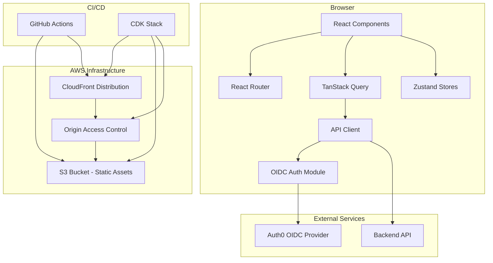

# Architecture Document

## Revision History

| Date | Author | Summary |
|------|--------|---------|
| 2025-07-15 | Flowlee Team | Initial architecture document |

---

## Table of Contents

1. [Project Structure](#project-structure)
2. [Routing Strategy](#routing-strategy)
3. [State Management](#state-management)
4. [API Client Design](#api-client-design)
5. [Authentication Flow](#authentication-flow)
6. [Environment Configuration](#environment-configuration)
7. [System Diagram](#system-diagram)

---

## Project Structure

The application follows a feature-based directory structure where each domain concern is self-contained within its own directory under `src/features/`. Shared utilities live in `src/lib/`, reusable UI components in `src/components/`, and global stores in `src/stores/`.

```
src/
├── main.tsx                    # Single React root render
├── App.tsx                     # Root providers (Auth, Query, Router)
├── index.css                   # Global styles
├── env.ts                      # Environment validation
├── routes.tsx                  # Single route configuration
├── components/
│   └── ui/                     # Shared UI components
├── features/
│   ├── onboarding/             # Onboarding wizard feature
│   │   ├── components/         # Feature-scoped components
│   │   ├── steps/              # Wizard step components
│   │   ├── store.ts            # Feature Zustand store
│   │   └── types.ts            # Feature types
│   ├── auth/                   # Authentication feature
│   │   ├── auth-provider.tsx   # OIDC context provider
│   │   ├── auth-guard.tsx      # Route guard component
│   │   └── callback.tsx        # OIDC callback handler
│   └── dashboard/              # Dashboard feature
├── lib/
│   ├── api-client.ts           # Typed fetch wrapper
│   ├── query-client.ts         # TanStack Query configuration
│   └── i18n.ts                 # i18next setup
├── stores/
│   └── ui-store.ts             # Global UI state (sidebar, theme)
└── locales/
    ├── en.json
    └── it.json
```

Each feature directory contains everything it needs: components, hooks, store, and types. This means adding a new feature never requires touching unrelated files, and removing a feature is a single directory deletion.

### Decision Rationale

A feature-based structure was chosen over flat (all components in one folder) or type-based (all hooks in one folder, all stores in another) because it colocates related code, making navigation intuitive and allowing the codebase to scale horizontally. When a new domain area is added, developers create a new directory under `features/` without polluting existing modules. This also makes code ownership boundaries clear in a multi-developer team.

---

## Routing Strategy

All routes are defined in a single file (`src/routes.tsx`) that serves as the sole source of truth for path-to-component mappings. Each route specifies whether it is public or authentication-guarded. Components are lazy-loaded via `React.lazy()` and wrapped in `React.Suspense` for code splitting.

```typescript
// Route definition shape
interface RouteDefinition {
  path: string;
  component: React.LazyExoticComponent<React.ComponentType>;
  isPublic: boolean;
  label?: string;
}
```

Routes are rendered by an `AppRoutes` component that reads from this configuration and wraps non-public routes with the `AuthGuard` component. A catch-all `*` route renders a 404 page for any unmatched URL.

Key routing behaviors:
- Unauthenticated users accessing guarded routes are redirected to the OIDC login page
- The originally requested URL is persisted and restored after successful authentication
- All route components are lazy-loaded to minimize initial bundle size

### Decision Rationale

A single route configuration file was chosen over file-system-based routing (like Next.js conventions) or scattered route definitions because it provides a single source of truth that is easy to audit, search, and reason about. At the current scale of the application (< 20 routes), the overhead of file-system routing is not justified. Having all routes in one place also makes it trivial to verify that no dead routes exist and that every public/private boundary is intentional.

---

## State Management

State management is split into two complementary systems based on the origin of the data:

**TanStack Query** handles all server state — data fetched from the backend API. It provides automatic caching, background refetching, retry logic, and cache invalidation.

**Zustand** handles all client state — local UI concerns like sidebar visibility, active wizard step, selected theme, and form state that is never persisted to the server.

### TanStack Query (Server State)

Configuration:
- Stale time: 5 minutes (data is considered fresh for 5 minutes after fetch)
- Retry: 3 attempts for failed queries, 0 for mutations
- Refetch on window focus: disabled

Usage pattern:
```typescript
// Fetching data
const { data, isLoading, error } = useQuery({
  queryKey: ['projects'],
  queryFn: () => apiClient.get<Project[]>('/api/projects'),
});

// Mutating data with cache invalidation
const mutation = useMutation({
  mutationFn: (project: CreateProject) => apiClient.post('/api/projects', project),
  onSuccess: () => queryClient.invalidateQueries({ queryKey: ['projects'] }),
});
```

### Zustand (Client State)

Each feature has its own colocated store in `src/features/<feature>/store.ts`. Global UI state shared across features lives in `src/stores/ui-store.ts`.

State changes are exposed exclusively through named action functions, preventing direct mutation from consuming components.

```typescript
// Feature-scoped store
const useOnboardingStore = create<OnboardingStore>((set) => ({
  activeStep: 0,
  setActiveStep: (step) => set({ activeStep: step }),
  reset: () => set({ activeStep: 0 }),
}));
```

### Decision Rationale

The TanStack Query + Zustand split was chosen over a monolithic state manager (Redux, MobX) because it establishes a clear boundary between server data and client data. Server state has fundamentally different characteristics (it can become stale, needs refetching, is shared across clients) that TanStack Query handles natively. Client state (UI toggles, wizard progress) is simpler and benefits from Zustand's minimal API with zero boilerplate. This combination avoids cache duplication — server data lives only in the query cache, never mirrored in a Zustand store.

---

## API Client Design

The API client (`src/lib/api-client.ts`) is a thin wrapper around the native Fetch API. It handles three concerns: request construction, token attachment, and error mapping.

### Responsibilities

1. **Base URL resolution** — Reads `VITE_API_BASE_URL` at module initialization and prepends it to all request paths
2. **Token attachment** — Retrieves the current access token from the auth module and attaches it as a `Bearer` token in the `Authorization` header
3. **Error mapping** — Converts non-2xx responses into structured `ApiError` objects with status, message, URL, and HTTP method

### Error Handling

| Scenario | Behavior |
|----------|----------|
| 401 response | Attempt silent token refresh → retry request once → if still 401, redirect to login |
| 4xx (non-401) | Throw `ApiError` with status code and response message |
| 5xx | Throw `ApiError` with status code and response message |
| Network failure | Throw `ApiError` with `status: null` and native error message |

### Interface

```typescript
export const apiClient = {
  get<TResponse>(path: string, options?: { requireAuth?: boolean }): Promise<TResponse>;
  post<TResponse, TBody>(path: string, body: TBody, options?: { requireAuth?: boolean }): Promise<TResponse>;
  put<TResponse, TBody>(path: string, body: TBody, options?: { requireAuth?: boolean }): Promise<TResponse>;
  patch<TResponse, TBody>(path: string, body: TBody, options?: { requireAuth?: boolean }): Promise<TResponse>;
  delete<TResponse>(path: string, options?: { requireAuth?: boolean }): Promise<TResponse>;
};
```

### Decision Rationale

A thin fetch wrapper was chosen over Axios or other HTTP libraries because it eliminates a dependency, reduces bundle size, and gives the team full control over the token lifecycle (attach, refresh, retry). The Fetch API is natively available in all target browsers and Node.js, so no polyfill is needed. The structured `ApiError` type ensures that error handling is consistent across the codebase without relying on Axios-specific interceptor patterns.

---

## Authentication Flow

Authentication uses Auth0 as the OIDC provider with the Authorization Code + PKCE flow. The `oidc-client-ts` library handles the protocol mechanics.

### Flow Overview

1. User navigates to a guarded route
2. `AuthGuard` checks authentication state; if unauthenticated, redirects to Auth0 login
3. User authenticates with Auth0
4. Auth0 redirects back to `/auth/callback` with an authorization code
5. Callback handler exchanges the code for tokens (access + refresh + ID token)
6. Tokens are stored in memory only (not localStorage, not cookies)
7. User is redirected to the originally requested URL
8. API client attaches the access token to subsequent requests

### Token Lifecycle

- **Storage**: In-memory only — tokens are lost on page refresh (triggers silent refresh)
- **Silent refresh**: Attempted automatically before token expiry via hidden iframe or refresh token
- **Refresh failure**: All tokens discarded, user redirected to login
- **Logout**: Session revoked with Auth0, all tokens cleared, redirect to application root

### Configuration

```typescript
// Environment variables
VITE_AUTH_AUTHORITY    // Auth0 tenant URL
VITE_AUTH_CLIENT_ID   // OIDC client ID (public client)
VITE_AUTH_AUDIENCE    // Auth0 API audience identifier
```

### Decision Rationale

Direct Auth0 OIDC integration with `oidc-client-ts` was chosen over vendor-specific SDKs (Clerk, @auth0/auth0-react) because it keeps the auth layer standard-compliant (any OIDC provider could be swapped in) and provides a small bundle footprint. In-memory token storage was chosen over localStorage to reduce XSS attack surface — a compromised script cannot read tokens from storage. The tradeoff (tokens lost on refresh) is mitigated by silent refresh.

---

## Environment Configuration

The application uses Vite's built-in environment variable system with build-time injection. Variables prefixed with `VITE_` are embedded into the JavaScript bundle at build time.

### Required Variables

| Variable | Purpose | Example |
|----------|---------|---------|
| `VITE_API_BASE_URL` | Backend API base URL | `https://api.dev.flowlee.com` |
| `VITE_AUTH_AUTHORITY` | Auth0 tenant URL | `https://flowlee.us.auth0.com` |
| `VITE_AUTH_CLIENT_ID` | Auth0 application client ID | `flowlee-frontend-dev` |
| `VITE_AUTH_AUDIENCE` | Auth0 API audience identifier | `https://api.flowlee.com` |

### Validation

At module initialization (`src/env.ts`), all required variables are validated. If any variable is undefined or empty, the module throws a descriptive error listing the missing variables. This causes the application to fail fast on startup rather than producing cryptic runtime errors later.

```typescript
// src/env.ts
function validateEnv(): AppEnv {
  const required = ['VITE_API_BASE_URL', 'VITE_AUTH_AUTHORITY', 'VITE_AUTH_CLIENT_ID'] as const;
  const missing = required.filter((key) => !import.meta.env[key]);
  if (missing.length > 0) {
    throw new Error(`Missing required environment variables: ${missing.join(', ')}`);
  }
  // ... return typed env object
}

export const env = validateEnv();
```

### Per-Stage Configuration

Each deployment stage (flowlee-dev, flowlee-test, flowlee-preprod, flowlee-prod) maintains its own set of environment values. The CI/CD pipeline injects the correct values during the build step for each stage, ensuring each deployment targets the correct backend and auth endpoints.

### Decision Rationale

Vite's standard `VITE_` prefix convention was chosen because it requires zero configuration — it works out of the box with any Vite project. Build-time injection was preferred over runtime configuration fetching because it eliminates a network request on startup and allows the application to fail fast during CI if variables are missing (the build itself fails). The `.env.example` file serves as living documentation of required configuration without containing actual secrets.

---

## System Diagram



### Data Flow

The data flow follows a unidirectional pattern:

1. **User interaction** → React component triggers navigation or data request
2. **Routing layer** → React Router resolves the target component, auth guard validates access
3. **Data fetching** → TanStack Query manages the request lifecycle (cache check → fetch → cache update)
4. **API layer** → API client constructs the request, attaches the auth token, sends to backend
5. **Auth layer** → OIDC module provides tokens, handles refresh on expiry
6. **Response** → Data flows back through TanStack Query cache into the component via reactive hooks
7. **Client state** → Zustand manages UI-only state independently from server data

This separation ensures that server data is never duplicated in client state stores, and UI state never leaks into the query cache.
